# Oracle 复习
## Week 11

使用PL/SQL时，不会自动提交，需要补上 **commit** 或手动提交。手动提交可以利用 **rollback** 实现回滚。

### PL/SQL 程序结构包括以下三部分
1. 声明部分（Declarative Section）：定义变量、常量、游标等。
2. 执行部分（Executable Section）：包含执行的PL/SQL语句。
3. 异常处理部分（Exception Handling Section）：处理程序中的异常或错误。

> 这里`%TYPE`的意义即令左侧的变量类型与右侧的保持一致。但注意，DECLARE部分仅仅是赋予变量的类型，也就是他们都是**没有被定义的**，实际上它们包含的是 `NULL` 值。
>
> 在 PL/SQL 中，`SELECT INTO` 是用来将查询结果**赋值给变量**的一种方法。它不同于标准的 SQL，因为 PL/SQL 是一种过程化的扩展语言，允许你在程序中处理数据和控制流程。`SELECT INTO` 语句用于从数据库中检索一行数据，并将其直接存储到变量中。
>
> `UPDATE ... SET ... WHERE` 是 SQL 语法中的更新语句，用于修改表中的数据。
>
> - **`NO_DATA_FOUND`**：这个异常是在 `SELECT INTO` 语句没有返回任何行时触发的。在你的代码中，如果 `SELECT empno, ename, sal INTO v_empno, v_ename, v_sal FROM emp WHERE ename = 'SMITH';` 没有找到名称为 `SMITH` 的员工，这个异常就会被触发。如果我们将下面的查询中`WHERE`一句的查询改为不存在的人名，就会报错为员工未找到。
>
> - **`OTHERS`**：这个异常捕获所有未被前面具体捕获的其他异常。它是一个通用的异常处理程序，用于捕获所有类型的运行时错误。
> - **`DBMS_OUTPUT.PUT_LINE('发生错误：' || SQLERRM);`**：当任何未被具体捕获的异常发生时，这条语句将会执行。`SQLERRM` 是一个内置函数，用于返回最近一次捕获的异常的错误消息。通过 `DBMS_OUTPUT.PUT_LINE`，错误消息将被输出到控制台或日志中。

```sql
DECLARE
    -- 声明部分：在这里定义变量
    v_empno emp.empno%TYPE;
    v_ename emp.ename%TYPE;
    v_sal emp.sal%TYPE;
    v_new_sal emp.sal%TYPE;
BEGIN
    -- 执行部分：包含PL/SQL执行的逻辑
    -- 从EMP表中选择一名员工的信息
    SELECT empno, ename, sal INTO v_empno, v_ename, v_sal
    FROM emp
    WHERE ename = 'SMITH';

    -- 计算新的工资，假设增加10%的工资
    v_new_sal := v_sal * 1.10;

    -- 更新员工的工资
    UPDATE emp
    SET sal = v_new_sal
    WHERE empno = v_empno;

    -- 提交事务
    COMMIT;

    -- 输出更新后的员工信息
    DBMS_OUTPUT.PUT_LINE('员工编号: ' || v_empno);
    DBMS_OUTPUT.PUT_LINE('员工姓名: ' || v_ename);
    DBMS_OUTPUT.PUT_LINE('原工资: ' || v_sal);
    DBMS_OUTPUT.PUT_LINE('新工资: ' || v_new_sal);
EXCEPTION
    -- 异常处理部分：处理在执行部分中发生的错误
    WHEN NO_DATA_FOUND THEN
        DBMS_OUTPUT.PUT_LINE('员工未找到');
    WHEN OTHERS THEN
        -- 捕获所有其他异常
        DBMS_OUTPUT.PUT_LINE('发生错误：' || SQLERRM);
END;
/
```

设置环境变量 **serveroutput** 启用服务器输出。这一行告诉SQLPlus将服务器端的输出显示在客户端屏幕上。
```oracle
set serveroutput on
```

看来它大部分类型都支持。

### 基本语法

> IF 语句
```sql
IF condition THEN
    statements;
ELSIF condition THEN
    statements;
ELSE
    statements;
END IF;
```
> LOOP 语句
```sql
LOOP
    statement1;
    ...
    EXIT [WHEN condition];
END LOOP
```
> While-Loop 语句
```sql
WHILE condition LOOP
    statement 1;
    statement 2;
    ...
END LOOP
```
>>例子
```sql
DECLARE
    v_counter NUMBER := 1;  -- 声明并初始化计数器变量
BEGIN
    -- WHILE循环
    WHILE v_counter <= 5 LOOP
        -- 输出当前计数器值
        DBMS_OUTPUT.PUT_LINE('当前计数器值: ' || v_counter);
        -- 增加计数器值
        v_counter := v_counter + 1;
    END LOOP;
END;
/
```
> For-loop 语句，这里的循环上下界之间要用..连接，注意是**两个点**而非三个，不同于大部分程序。
```sql
FOR counter IN [REVERSE]
        lower_bound..upper_bound LOOP
    statement1;
    statement2;
    ...
END LOOP;
```
>>例子
```sql
BEGIN
    -- 正向FOR循环
    FOR i IN 1..5 LOOP
        DBMS_OUTPUT.PUT_LINE('正向循环：i = ' || i);
    END LOOP;
END;
/
```

**在PL/SQL中使用SQL**

1. 可直接使用 **DML** 语句
2. select ... into ...
3. 不能使用 **DDL** 语句

尽管不能直接使用 DDL 语句（如 CREATE、ALTER、DROP 等），但可以通过动态 SQL 进行执行。使用 `EXECUTE IMMEDIATE` 可以在 PL/SQL 中执行 DDL 语句。以下是DML（数据操作语言）和DDL（数据定义语言）语句的列表：

#### DML 语句

| 语句       | 描述                                          |
|------------|-----------------------------------------------|
| `SELECT`   | 从数据库表中检索数据                          |
| `INSERT`   | 向数据库表中插入新的数据                      |
| `UPDATE`   | 更新数据库表中的现有数据                      |
| `DELETE`   | 从数据库表中删除数据                          |
| `MERGE`    | 合并两张表的数据，进行插入或更新操作          |
| `CALL`     | 调用存储过程或函数                            |
| `LOCK TABLE` | 锁定数据库表以控制并发访问                |
| `EXPLAIN PLAN` | 显示SQL语句的执行计划                    |

#### DDL 语句

| 语句       | 描述                                          |
|------------|-----------------------------------------------|
| `CREATE`   | 创建数据库对象（如表、视图、索引、序列等）   |
| `ALTER`    | 修改现有的数据库对象                          |
| `DROP`     | 删除数据库对象                                |
| `TRUNCATE` | 清空表中的所有数据，但保留表结构              |
| `COMMENT`  | 添加或修改数据库对象的注释                    |
| `RENAME`   | 重命名数据库对象                              |
| `GRANT`    | 授予用户权限                                  |
| `REVOKE`   | 撤销用户权限                                  |
| `ANALYZE`  | 收集有关数据库对象的统计信息                  |

#### DML 示例

```sql
-- SELECT 示例
SELECT * INTO * FROM emp WHERE empno = 7369;

-- INSERT 示例
INSERT INTO emp (empno, ename, job, sal) VALUES (1234, 'JOHN', 'MANAGER', 5000);

-- UPDATE 示例
UPDATE emp SET sal = sal * 1.1 WHERE empno = 1234;

-- DELETE 示例
DELETE FROM emp WHERE empno = 1234;
```

#### DDL 示例

```sql
-- CREATE 示例
CREATE TABLE test_table (id NUMBER, name VARCHAR2(50));

-- ALTER 示例
ALTER TABLE test_table ADD (address VARCHAR2(100));

-- DROP 示例
DROP TABLE test_table;

-- TRUNCATE 示例
TRUNCATE TABLE emp;

-- COMMENT 示例
COMMENT ON TABLE emp IS 'Employee table';

-- RENAME 示例
RENAME test_table TO new_test_table;
```

### PL/SQL 程序的几种形式
#### 匿名块 `与SQL语句类似，在客户端中直接做adhoc查询`
  + 没有名称，不存储在数据库中。
  + 常用于临时操作或测试。
  + 可以在SQL*Plus、SQL Developer等工具中直接执行。
```sql
DECLARE

BEGIN

END;
/
```
#### 存储过程 `作为数据库对象保存在数据库中的代码，通过参数进行输入输出数据交换`
  + 存储在数据库中，可以被多个用户和应用程序共享。
  + 可以接受输入参数和输出参数，但不返回值。
  + 常用于封装业务逻辑、数据验证和批量操作。

> **无需先删除再创建**：如果存储过程或存储函数已经存在，你不需要先执行 `DROP` 语句来删除旧的版本，然后再执行 `CREATE` 语句来创建新的版本。`CREATE OR REPLACE` 会自动替换已有的对象。
>
> 在 PL/SQL 中，`AS` 关键字用于定义存储过程或存储函数的主体，并且是必须的。**它用于引入过程或函数的实现部分**。你可以将 `AS` 视为过程或函数声明部分和实现部分之间的分隔符。

**减少错误**：使用 `DROP` 语句可能会导致误删除其他相关对象，而 `CREATE OR REPLACE` 则避免了这种风险。

```sql
CREATE OR REPLACE PROCEDURE update_salary (
    p_empno IN emp.empno%TYPE,
    p_percentage IN NUMBER
) IS
BEGIN
    UPDATE emp
    SET sal = sal + (sal * p_percentage / 100)
    WHERE empno = p_empno;
    COMMIT;  
END;
/
```
调用存储过程
```sql
BEGIN
    update_salary(7369, 10); -- 将员工编号为7369的工资增加10%
END;
/
```
#### 存储函数 `作为数据库对象保存在数据库中的代码，需要有返回值作为函数的输出`
  + 存储在数据库中，可以被多个用户和应用程序共享。
  + 需要返回一个值。
  + 常用于计算和数据转换。

> 在 PL/SQL 中，存储过程或存储函数的变量声明是放在 `AS` 或 `IS` 关键字后面的，这些声明等价于在匿名块中的 `DECLARE` 部分进行的声明。无论是存储过程、存储函数还是匿名块，变量声明的语法和作用都是一致的。

```sql
CREATE OR REPLACE FUNCTION get_employee_salary (
    p_empno IN emp.empno%TYPE
) RETURN NUMBER
AS
    v_sal emp.sal%TYPE;
BEGIN
    SELECT sal
    INTO v_sal
    FROM emp
    WHERE empno = p_empno;
    -- 这里 INTO 即为赋值
    
    RETURN v_sal;
EXCEPTION
    WHEN NO_DATA_FOUND THEN
        RETURN NULL;
    WHEN OTHERS THEN
        -- 可以根据需要处理其他异常
        RETURN NULL;
END;
/
```
调用存储函数
```sql
DECLARE
    v_salary NUMBER;
BEGIN
    v_salary := get_employee_salary(7369); -- 获取员工编号为7369的工资
    DBMS_OUTPUT.PUT_LINE('员工工资: ' || v_salary);
END;
/
```
#### 使用存储过程与存储函数的好处
+ 集中修改，方便维护
+ 速度更快（省去网络传输与编译时间）
+ 可以受到数据库权限机制保护

#### 怎样调用存储过程和存储函数
+ 在sqlplus中使用**存储过程**，打入“exec <过程名>”，注意，存储函数不能直接exec，但是可以用select中直接调用

```sql
SQL> SELECT get_employee_salary(7369) FROM dual;

GET_EMPLOYEE_SALARY(7369)
-------------------------
                  1344.31
```

+ 在程序中使用**存储过程**，直接使用<过程名>即可
+ 使用存储函数与使用标准SQL函数没有区别

### 存储过程示例
这个存储过程将给定员工编号的工资增加一个指定的百分比。
```sql
CREATE OR REPLACE PROCEDURE increase_salary (
    p_empno IN emp.empno%TYPE,
    p_percentage IN NUMBER
) AS
BEGIN
    UPDATE emp
    SET sal = sal * (1 + p_percentage / 100)
    WHERE empno = p_empno;

    COMMIT;
END;
/
```
#### 调用存储过程

**在SQL*Plus中使用存储过程**

```sql
-- 启用服务器输出以便查看结果
SET SERVEROUTPUT ON;

-- 使用 EXEC 调用存储过程
EXEC increase_salary(7369, 10); 
-- 将员工编号为7369的工资增加10%
```

**在PL/SQL块中调用存储过程**

```sql
BEGIN
    increase_salary(7369, 10); -- 将员工编号为7369的工资增加10%
END;
/
```

### 存储函数示例

#### 创建存储函数
这个存储函数返回给定员工编号的工资。

```sql
CREATE OR REPLACE FUNCTION get_salary (
    p_empno IN emp.empno%TYPE
) RETURN NUMBER
AS
    v_sal emp.sal%TYPE;
BEGIN
    SELECT sal INTO v_sal
    FROM emp
    WHERE empno = p_empno;

    RETURN v_sal;
END;
/
```

#### 调用存储函数

**在SQL*Plus中调用存储函数**
```sql
-- 启用服务器输出以便查看结果
SET SERVEROUTPUT ON;

DECLARE
    v_salary NUMBER;
BEGIN
    v_salary := get_salary(7369); -- 获取员工编号为7369的工资
    DBMS_OUTPUT.PUT_LINE('员工工资: ' || v_salary);
END;
/
```

**在SQL查询中使用存储函数**
```sql
SELECT get_salary(7369) AS salary FROM dual;
```

### 包和包体

在Oracle数据库中，包（Package）是一个逻辑分组，用于包含相关的PL/SQL类型、变量、过程、函数和游标。包由包规范（Package Specification）和包体（Package Body）组成。

#### 包规范（Package Specification）
包规范是包的接口，声明包中包含的所有公共元素（如过程和函数的定义）。包规范不包含实现细节，只提供调用信息。

#### 包体（Package Body）
包体包含包中所有过程和函数的具体实现。包体可以包含包规范中声明的公共元素的实现以及一些私有元素，这些私有元素只在包体内可见。

#### 创建包和包体的步骤
1. **创建包规范**
```sql
CREATE OR REPLACE PACKAGE package_name IS
  -- 公共过程和函数的声明
  PROCEDURE procedure_name(param1 datatype, param2 datatype);
  FUNCTION function_name(param1 datatype, param2 datatype) RETURN datatype;
END package_name;
```

2. **创建包体**
```sql
CREATE OR REPLACE PACKAGE BODY package_name IS
  -- 公共过程和函数的实现
  PROCEDURE procedure_name(param1 datatype, param2 datatype) IS
  BEGIN
    -- 过程体
  END procedure_name;

  FUNCTION function_name(param1 datatype, param2 datatype) RETURN datatype IS
  BEGIN
    -- 函数体
  END function_name;
END package_name;
```

#### 调用包中的过程和函数
一旦包和包体创建完毕，可以通过以下方式调用包中的过程和函数：

```sql
-- 调用包中的过程
BEGIN
  package_name.procedure_name(param1_value, param2_value);
END;
```

```sql
-- 调用包中的函数
DECLARE
  result datatype;
BEGIN
  result := package_name.function_name(param1_value, param2_value);
  DBMS_OUTPUT.PUT_LINE(result);
END;
```

#### 示例
以下是一个创建和调用包及包体的完整示例：

1. **创建包规范**
```sql
CREATE OR REPLACE PACKAGE example_pkg IS
  PROCEDURE say_hello(name VARCHAR2);
  FUNCTION add_numbers(a NUMBER, b NUMBER) RETURN NUMBER;
END example_pkg;
```

2. **创建包体**
```sql
CREATE OR REPLACE PACKAGE BODY example_pkg IS
  PROCEDURE say_hello(name VARCHAR2) IS
  BEGIN
    DBMS_OUTPUT.PUT_LINE('Hello, ' || name || '!');
  END say_hello;

  FUNCTION add_numbers(a NUMBER, b NUMBER) RETURN NUMBER IS
  BEGIN
    RETURN a + b;
  END add_numbers;
END example_pkg;
```

3. **调用包中的过程和函数**
```sql
-- 调用say_hello过程
BEGIN
  example_pkg.say_hello('Alice');
END;
/

-- 调用add_numbers函数
DECLARE
  result NUMBER;
BEGIN
  result := example_pkg.add_numbers(10, 20);
  DBMS_OUTPUT.PUT_LINE('Sum: ' || result);
END;
/
```

### wm_concat 函数

+ Oracle的内测函数
+ 另一种方式的列转行
+ Mysql中类似的函数是group_concat
+ 输出是clob类型

> 在 Oracle 19c 中，`WM_CONCAT` 已经被弃用，并且不再可用。取而代之的是标准 SQL 中的 `LISTAGG` 函数，它提供了更强大和灵活的字符串聚合功能。

#### 示例
```sql
-- 使用WM_CONCAT函数按部门将员工名字连接成一个字符串
SELECT deptno, WM_CONCAT(ename) AS employees
FROM emp
GROUP BY deptno;
```

### listagg 函数

> 这样就可以在聚类后查看所有人的名字，而非需要多行才能查看

```sql
-- 使用LISTAGG函数按部门将员工名字连接成一个字符串
SELECT deptno, LISTAGG(ename, ',') WITHIN GROUP (ORDER BY ename) AS employees
FROM emp
GROUP BY deptno;
```

---

## Week 12

### %type 变量类型
在 PL/SQL 中，%TYPE 是一种变量声明方式，允许我们基于数据库表中的列定义变量。这样声明的变量会自动采用对应列的属性，包括数据类型和长度。这种方式有助于保持数据类型的一致性和提高代码的可维护性。
#### 语法
```sql
identifier Table.column_name%TYPE;
```
- **identifier**：变量名称。
- **Table.column_name**：数据库表和列的名称。

#### 示例解释
```sql
DECLARE
    v_name employees.last_name%TYPE;   -- 声明一个变量，其类型与 employees 表中 last_name 列的类型相同
    v_balance NUMBER(7,2);             -- 声明一个变量，类型为 NUMBER，精度为 7，标度为 2
    v_min_balance v_balance%TYPE := 10;-- 声明一个变量，其类型与 v_balance 变量的类型相同，并初始化为 10
BEGIN

END;
/
```

#### 优点

- **类型一致性**：使用 `%TYPE` 可以确保变量与表列的数据类型一致，避免数据类型不匹配的问题。
- **代码可维护性**：当表结构发生变化时（例如列的数据类型变化），不需要修改 PL/SQL 代码中变量的类型，只需修改表结构即可。

### %rowtype 变量类型
在 PL/SQL 中，`%ROWTYPE` 是一种变量声明方式，用于声明一个记录（record）类型的变量，该变量的结构与指定表或游标的行结构相同。`%ROWTYPE` 使我们能够处理整行数据，而不仅仅是单个列的数据。

#### 语法

```sql
identifier Table%ROWTYPE;
identifier Cursor%ROWTYPE;
```

- **identifier**：变量名称。
- **Table**：数据库表的名称。
- **Cursor**：PL/SQL 游标的名称。

#### 示例解释

```sql
DECLARE
    -- 声明一个记录变量 v_emp_row，其结构与 EMP 表的行结构相同
    v_emp_row emp%ROWTYPE;
BEGIN
    -- 查询员工信息并赋值给记录变量 v_emp_row
    SELECT * INTO v_emp_row
    FROM emp
    WHERE empno = 7369;
    
    -- 输出记录变量 v_emp_row 中的各列值
    DBMS_OUTPUT.PUT_LINE('员工编号: ' || v_emp_row.empno);
    DBMS_OUTPUT.PUT_LINE('员工姓名: ' || v_emp_row.ename);
    DBMS_OUTPUT.PUT_LINE('员工职位: ' || v_emp_row.job);
    DBMS_OUTPUT.PUT_LINE('员工经理: ' || v_emp_row.mgr);
    DBMS_OUTPUT.PUT_LINE('入职日期: ' || v_emp_row.hiredate);
    DBMS_OUTPUT.PUT_LINE('员工工资: ' || v_emp_row.sal);
    DBMS_OUTPUT.PUT_LINE('员工佣金: ' || v_emp_row.comm);
    DBMS_OUTPUT.PUT_LINE('部门编号: ' || v_emp_row.deptno);
END;
/
```

1. **`v_emp_row emp%ROWTYPE`**：
   - 声明一个记录变量 `v_emp_row`，它的结构与 `emp` 表的行结构相同。
   - 这个变量将包含 `emp` 表的所有列。

2. **`SELECT * INTO v_emp_row FROM emp WHERE empno = 7369`**：
   - 从 `emp` 表中选择一行（员工编号为 7369 的员工）并将其赋值给记录变量 `v_emp_row`。
   - 这样 `v_emp_row` 变量的每个字段将对应 `emp` 表的一列。

3. **输出记录变量 `v_emp_row` 中的各列值**：
   - 使用 `DBMS_OUTPUT.PUT_LINE` 输出记录变量 `v_emp_row` 中每个字段的值。

#### 使用优点

- **方便处理整行数据**：使用 `%ROWTYPE` 可以简化对整行数据的操作，而不需要单独声明每一列的变量。
- **类型一致性**：确保记录变量的各个字段与表或游标的列类型一致。
- **提高代码可读性**：使代码更简洁易读，特别是在需要处理多列数据时。

#### 使用场景

- **处理表或游标的一整行数据**：在需要处理表或游标的一整行数据时，使用 `%ROWTYPE` 变量类型可以避免单独声明每一列的变量。
- **批量处理和游标循环**：在批量处理和游标循环中，使用 `%ROWTYPE` 可以简化代码结构。

#### 示例：在游标中使用 %ROWTYPE

```sql
DECLARE
    -- 声明一个游标，选择 EMP 表中的所有记录
    CURSOR emp_cursor IS
        SELECT * FROM emp;
    
    -- 声明一个记录变量 v_emp_row，其结构与游标 emp_cursor 的行结构相同
    v_emp_row emp_cursor%ROWTYPE;
BEGIN
    -- 打开游标
    OPEN emp_cursor;
    
    -- 循环遍历游标中的每一行
    LOOP
        -- 提取游标中的一行数据到记录变量 v_emp_row
        FETCH emp_cursor INTO v_emp_row;
        
        -- 当没有更多行时退出循环
        EXIT WHEN emp_cursor%NOTFOUND;
        
        -- 输出记录变量 v_emp_row 中的各列值
        DBMS_OUTPUT.PUT_LINE('员工编号: ' || v_emp_row.empno);
        DBMS_OUTPUT.PUT_LINE('员工姓名: ' || v_emp_row.ename);
    END LOOP;
    
    -- 关闭游标
    CLOSE emp_cursor;
END;
/
```

在这个示例中，使用 `%ROWTYPE` 简化了游标循环中的数据处理，使代码更加简洁和易于维护。

### 游标的类型

**基本游标**

```sql
CURSOR emp_cursor IS
    SELECT * FROM emp;
```

**参数化游标 **

参数化游标允许在定义游标时传递参数，以便在查询中使用这些参数。这使得游标更加灵活和可重用。

```sql
CURSOR emp_cursor (p_deptno NUMBER) IS
    SELECT * FROM emp WHERE deptno = p_deptno;
```

而利用游标提取的代码为`fetch ... into ...`

```sql
FETCH emp_cursor INTO v_emp_row;
```

### Record 类型

### 理解 PL/SQL 中的 Record 类型

在 PL/SQL 中，`Record` 类型是一种复合数据类型，它可以包含多个字段，每个字段可以具有不同的数据类型。`Record` 类型类似于编程语言中的结构体（`struct`）或对象（`object`），用于存储相关联的数据。使用 `Record` 类型可以更方便地组织和管理复杂的数据结构。

### 定义和使用 Record 类型
使用 `TYPE` 关键字可以在 PL/SQL 块、包或数据库级别声明自定义的 Record 类型。

#### 示例

```sql
DECLARE
    -- 声明一个 Record 类型
    TYPE employee_record IS RECORD (
        empno   emp.empno%TYPE,
        ename   emp.ename%TYPE,
        job     emp.job%TYPE,
        sal     emp.sal%TYPE
    );
    
    -- 声明一个变量，该变量的类型为 employee_record
    v_employee employee_record;
BEGIN
    -- 使用 SELECT 语句将数据赋值给 Record 变量
    SELECT empno, ename, job, sal
    INTO v_employee
    FROM emp
    WHERE empno = 7369;
    
    -- 输出 Record 变量的各个字段
    DBMS_OUTPUT.PUT_LINE('员工编号: ' || v_employee.empno);
    DBMS_OUTPUT.PUT_LINE('员工姓名: ' || v_employee.ename);
    DBMS_OUTPUT.PUT_LINE('员工职位: ' || v_employee.job);
    DBMS_OUTPUT.PUT_LINE('员工工资: ' || v_employee.sal);
END;
/
```

#### 使用 Record 类型的优点

1. **方便管理相关数据**：将相关数据封装在一个记录中，方便管理和传递。
2. **提高代码可读性**：代码更简洁，易于理解和维护。
3. **类型一致性**：使用 `%ROWTYPE` 保证记录字段类型与表或游标列类型一致，减少数据类型不匹配的问题。

#### Record 类型的使用场景

- **复杂数据结构**：在需要管理复杂的数据结构时，使用 Record 类型可以将相关数据封装在一起。
- **批量处理和游标循环**：在批量处理和游标循环中，使用 Record 类型可以简化数据处理。
- **存储过程和函数**：在存储过程和函数中，可以使用 Record 类型作为参数或返回值，以便传递复杂的数据结构。
  

### 游标详细用法

在 PL/SQL 中，游标（Cursor）是一种用于处理查询结果集的机制。游标允许我们逐行处理查询返回的多行数据。PL/SQL 支持两种类型的游标：显式游标（Explicit Cursor）和隐式游标（Implicit Cursor）。

#### 游标使用的基本步骤

1. **DECLARE（声明游标）**：创建一个命名的 SQL 区域。
2. **OPEN（打开游标）**：标识活动集（active set）。
3. **FETCH（提取数据）**：将当前行加载到变量中。
4. **CLOSE（关闭游标）**：释放活动集。

#### 示例：使用显式游标

1. **声明游标**：
   
   ```sql
   CURSOR emp_cursor IS
       SELECT empno, ename, job, sal
       FROM emp;
   ```
   - 这段代码声明了一个名为 `emp_cursor` 的游标，该游标选择 `EMP` 表中的所有记录。
   
2. **声明记录变量**：
   ```sql
   v_emp_row emp_cursor%ROWTYPE;
   ```
   - 声明一个记录变量 `v_emp_row`，其结构与游标 `emp_cursor` 的行结构相同。

3. **打开游标**：
   ```sql
   OPEN emp_cursor;
   ```
   - 打开游标 `emp_cursor`，准备提取数据。

4. **循环提取数据**：
   ```sql
   LOOP
       FETCH emp_cursor INTO v_emp_row;
       EXIT WHEN emp_cursor%NOTFOUND;
       DBMS_OUTPUT.PUT_LINE('员工编号: ' || v_emp_row.empno);
       DBMS_OUTPUT.PUT_LINE('员工姓名: ' || v_emp_row.ename);
       DBMS_OUTPUT.PUT_LINE('员工职位: ' || v_emp_row.job);
       DBMS_OUTPUT.PUT_LINE('员工工资: ' || v_emp_row.sal);
   END LOOP;
   ```
   - 在循环中，从游标 `emp_cursor` 提取一行数据到记录变量 `v_emp_row`。
   - 当提取到的行数为 0 时，退出循环。
   - 输出记录变量 `v_emp_row` 中的各列值。

5. **关闭游标**：
   ```sql
   CLOSE emp_cursor;
   ```
   - 关闭游标 `emp_cursor`，释放相关资源。

#### 小结

使用显式游标时，需要手动管理游标的生命周期，包括声明、打开、提取和关闭。通过显式游标，可以逐行处理查询结果集，适用于需要逐行处理数据的场景。

#### 隐式游标

隐式游标由 Oracle 数据库自动管理，通常在执行 DML 语句（如 `INSERT`、`UPDATE`、`DELETE` 和 `SELECT INTO`）时使用。

#### 示例：使用隐式游标

```sql
DECLARE
    v_empno emp.empno%TYPE;
    v_ename emp.ename%TYPE;
    v_job emp.job%TYPE;
    v_sal emp.sal%TYPE;
BEGIN
    -- 使用隐式游标选择一行数据
    SELECT empno, ename, job, sal INTO v_empno, v_ename, v_job, v_sal
    FROM emp
    WHERE empno = 7369;
    
    -- 输出选择的数据
    DBMS_OUTPUT.PUT_LINE('员工编号: ' || v_empno);
    DBMS_OUTPUT.PUT_LINE('员工姓名: ' || v_ename);
    DBMS_OUTPUT.PUT_LINE('员工职位: ' || v_job);
    DBMS_OUTPUT.PUT_LINE('员工工资: ' || v_sal);
END;
/
```

隐式游标简单易用，适用于处理单行查询结果的情况。Oracle 会自动管理隐式游标的生命周期。

### 查看编译错误
```sql
show errors
```


### 例外处理
- **系统预定义异常**：Oracle预先定义的标准异常，直接使用异常名称进行处理。

系统预定义异常是Oracle预先定义的标准异常。这些异常与常见的错误条件相关联，并且有具体的名称。可以直接在异常处理部分使用这些异常名称进行处理。

#### 常见的系统预定义异常

| 异常名称          | 错误代码 | 描述                                     |
|-------------------|----------|------------------------------------------|
| `NO_DATA_FOUND`   | ORA-01403 | 当`SELECT INTO`语句未返回任何行时触发。  |
| `TOO_MANY_ROWS`   | ORA-01422 | 当`SELECT INTO`语句返回多于一行时触发。  |
| `ZERO_DIVIDE`     | ORA-01476 | 当尝试除以零时触发。                     |
| `INVALID_CURSOR`  | ORA-01001 | 当尝试操作无效游标时触发。               |
| `DUP_VAL_ON_INDEX`| ORA-00001 | 当尝试插入重复值违反唯一性约束时触发。   |

- **非预定义的系统异常**：Oracle中存在但没有预定义名称的异常，使用错误代码和`PRAGMA EXCEPTION_INIT`进行处理。
```sql
DECLARE
    -- 声明自定义异常
    e_custom_exception EXCEPTION;
    -- 将错误代码与自定义异常关联，当该错误代码发生时，用户定义的异常会被触发，从而允许你使用异常处理代码来处理这个特定的错误。
    PRAGMA EXCEPTION_INIT(e_custom_exception, -1403);
BEGIN
    -- 尝试执行一个返回无数据的查询
    DECLARE
        v_name emp.ename%TYPE;
    BEGIN
        SELECT ename INTO v_name FROM emp WHERE empno = 9999;
    EXCEPTION
        WHEN e_custom_exception THEN
            DBMS_OUTPUT.PUT_LINE('错误：没有找到数据');
    END;
END;
/
```
- **用户自定义异常**：程序员定义的异常，用于处理特定业务逻辑中的错误，通过声明、引发和处理自定义异常进行管理。
  1. **声明异常**：在声明部分定义异常。
  2. **引发异常**：在执行部分使用`RAISE`语句引发异常。`RAISE` 语句用于显式引发一个异常。异常可以是系统定义的异常，也可以是用户定义的异常。使用 `RAISE` 语句，可以在程序逻辑中遇到特定情况时引发异常，以便控制流转到异常处理部分。
  3. **处理异常**：在异常处理部分捕获和处理异常。
```sql
DECLARE
    -- 声明用户自定义异常
    e_salary_too_high EXCEPTION;
    -- 定义工资上限
    v_max_salary CONSTANT NUMBER := 10000;
BEGIN
    -- 假设有一个员工的工资
    DECLARE
        v_salary emp.sal%TYPE := 15000;
    BEGIN
        -- 检查工资是否超过上限
        IF v_salary > v_max_salary THEN
            -- 引发自定义异常
            RAISE e_salary_too_high;
        END IF;
    EXCEPTION
        WHEN e_salary_too_high THEN
            DBMS_OUTPUT.PUT_LINE('错误：工资过高');
    END;
END;
/
```

### 触发器

1. ### 触发器

   触发器（`Trigger`）是数据库中的一种特殊存储过程，它在满足特定条件时会自动执行。触发器可以在数据被插入、更新或删除时自动触发，以实现自动审计、数据校验或实现复杂的业务逻辑。触发器可以分为表级触发器和行级触发器。

   #### 特点和分类
   1. **特殊的存储过程**：触发器是一种特殊的存储过程，当满足一定条件时会被自动触发运行（fire）。
   2. **常见触发条件**：触发条件包括 `BEFORE` 和 `AFTER` 某种DML语句（如 `INSERT`、`UPDATE`、`DELETE`），以及系统事件（如用户登录、登出数据库，数据库启动或关闭）的触发器（系统级触发器）。
   3. **表级触发器与行级触发器**：
      - **表级触发器**：在表级别操作时触发，例如在对表执行一次 `INSERT` 操作时触发一次。
      - **行级触发器**：在每行数据操作时触发，例如在对表的每一行执行 `INSERT` 操作时分别触发。

   #### 示例
   以下是一个在 Oracle 数据库中创建触发器的示例：

   ```sql
   -- 创建表
   CREATE TABLE employees (
       emp_id NUMBER PRIMARY KEY,
       name VARCHAR2(100),
       salary NUMBER
   );
   
   -- 创建一个行级 BEFORE INSERT 触发器
   CREATE OR REPLACE TRIGGER before_insert_employees
   BEFORE INSERT ON employees
   FOR EACH ROW
   BEGIN
       -- 插入之前验证工资是否为正数
       IF :NEW.salary <= 0 THEN
           RAISE_APPLICATION_ERROR(-20001, 'Salary must be greater than zero');
       END IF;
   END;
   /
   
   -- 插入数据，触发器会自动检查工资是否为正数
   INSERT INTO employees (emp_id, name, salary) VALUES (1, 'John Doe', 5000);
   -- 这条插入语句将失败，因为工资为负数
   INSERT INTO employees (emp_id, name, salary) VALUES (2, 'Jane Doe', -3000);
   ```

   在这个例子中，我们创建了一个名为 `before_insert_employees` 的行级触发器，它在向 `employees` 表插入数据之前自动运行。如果新插入的行的工资不大于零，则触发器会抛出一个异常，阻止插入操作。

   #### 多个触发器的触发顺序

   当一个表绑定了多个触发器时，它们的触发次序由触发器的类型和定义的顺序决定：

   1. **类型优先级**：
      - `BEFORE` 触发器先于 `AFTER` 触发器执行。
   2. **定义顺序**：
      - 对于相同类型的触发器，Oracle 数据库按照它们的创建顺序执行。

   例如，如果我们有两个 `BEFORE INSERT` 触发器和一个 `AFTER INSERT` 触发器：

   ```sql
   -- 创建第一个 BEFORE INSERT 触发器
   CREATE OR REPLACE TRIGGER before_insert_emp_trigger1
   BEFORE INSERT ON emp
   FOR EACH ROW
   BEGIN
       -- 逻辑1：输出触发器1的执行信息
       DBMS_OUTPUT.PUT_LINE('Before Insert Trigger 1');
       -- 验证工资是否为正数
       IF :NEW.sal <= 0 THEN
           RAISE_APPLICATION_ERROR(-20001, 'Salary must be greater than zero');
       END IF;
   END;
   /
   
   -- 创建第二个 BEFORE INSERT 触发器
   CREATE OR REPLACE TRIGGER before_insert_emp_trigger2
   BEFORE INSERT ON emp
   FOR EACH ROW
   BEGIN
       -- 逻辑2：输出触发器2的执行信息
       DBMS_OUTPUT.PUT_LINE('Before Insert Trigger 2');
   END;
   /
   
   -- 创建 AFTER INSERT 触发器
   CREATE OR REPLACE TRIGGER after_insert_emp_trigger
   AFTER INSERT ON emp
   FOR EACH ROW
   BEGIN
       -- 逻辑3：输出触发器3的执行信息
       DBMS_OUTPUT.PUT_LINE('After Insert Trigger');
   END;
   /
   ```

   当我们插入数据时，触发器的执行顺序如下：
   1. `before_insert_trigger1`
   2. `before_insert_trigger2`
   3. `after_insert_trigger`

   这个顺序由触发器的类型和定义的顺序共同决定。

### 禁止和删除触发器  

1. 禁用触发器 alter trigger tri_uname(触发器名字) disable;
2. 激活触发器 alter trigger tri_uname(触发器名字) enable;
3. 重新编译 alter trigger tri_uname(触发器名字) complie;
4. 禁用某个表上的触发器 alter table table_name(表名) diable all triggers;
5. 删除触发器 DROP TRIGGER tri_uname(触发器名字);

---

## Week 13

**内置包** `DBMS_DDL`, `DBMS_LOB`, `DBMS_JOB`, …

### DBMS_DDL 包执行DDL语句

使用`DBMS_DDL`包也可以实现在 PL/SQL 代码中执行DDL语句的功能。

在Oracle数据库中，`DBMS_DDL`包提供了多种操作DDL（数据定义语言）语句的功能。使用这个包，可以在PL/SQL代码中执行诸如创建、修改和删除数据库对象的操作。下面是一些具体的方法和示例说明。

#### 主要方法

1. **`DBMS_DDL.EXECUTE_DDL`**: 这个方法可以执行任何DDL语句。
   
2. **`DBMS_DDL.CREATE_WRAPPED`**: 这个方法可以创建加密的PL/SQL对象。

#### 示例说明

1. 执行DDL语句

在PL/SQL代码中创建一个新表，可以使用`DBMS_DDL.EXECUTE_DDL`方法来实现。

```sql
BEGIN
  EXECUTE IMMEDIATE 'CREATE TABLE employees (emp_id NUMBER, emp_name VARCHAR2(50))';
END;
/
```

上述代码会在当前模式下创建一个名为`employees`的新表，包含`emp_id`和`emp_name`两个列。

2. 删除表

同样，也可以使用`DBMS_DDL.EXECUTE_DDL`来删除表。

```sql
BEGIN
  EXECUTE IMMEDIATE 'DROP TABLE employees';
END;
/
```

这段代码会删除名为`employees`的表。

3. 修改表

修改表的结构也可以通过`DBMS_DDL.EXECUTE_DDL`来实现。例如，增加一个新列：

```sql
BEGIN
  EXECUTE IMMEDIATE('ALTER TABLE employees ADD (emp_address VARCHAR2(100))');
END;
/
```

这段代码会在`employees`表中增加一个名为`emp_address`的新列。

#### 使用注意事项

1. **权限**: 执行DDL操作需要相应的数据库权限，例如创建或删除表的权限。
2. **事务处理**: DDL语句通常会隐式地提交事务。因此，在PL/SQL中使用`DBMS_DDL`包时，需要注意事务的管理。
3. **错误处理**: 建议在执行DDL语句时添加错误处理机制，以便在出错时能够捕获和处理异常。

### DBMS_JOB 包实现定时任务

利用内置包`DBMS_JOB`建立定时任务，每五分钟在特定表中插入一条记录，内容为 emp 表的行数以及时间戳

```sql
create table emp_record{
	time date;
	record number(10)
};
```

创建用于记录的存储过程

```sql
create or replace procedure emprec is
begin
	insert into emp_record values(
    	sysdate,
    	(select count(*) from emp)
    );
    commit;
end;
/
```

创建定时任务：

```sql
declare jobnum number := 1;
begin
	dbms_job.submit(
    	:jobnum,
        'emprec;',
        sysdate,
        'sysdate + 1/24/12'
	);
	commit;
end;
/
```

### Oracle系统包含的主要文件

#### 数据文件

- **功能**: 提供存储数据的物理基础。
- **内容**: Oracle所有的数据都放置在数据文件内，这些数据文件与数据库对象（表，视图，存储过程，索引等）并非1对1对应的关系。
- **特别说明**: 与MySQL的MyISAM存储引擎的确实如此。

#### 控制文件

- **功能**: 存放数据库基本信息。
- **内容**: 包括数据库名、时间戳、数据文件和日志文件的位置、日志切换和检查点情况等。
- **启动过程**: 数据库启动时首先找到控制文件，再根据控制文件的指引找到并加载其它数据文件和日志文件完成启动。
- **重要性**: 由于控制文件的重要性，一般具有多个冗余的镜像。

#### 日志文件

- **功能**: 保存redo日志分析。
- **作用**: 当发生掉电或介质损坏时，用它进行恢复。
- **配置**: 日志文件一般设置多组（轮流使用），每组内设置镜像防止损坏丢失。

这些文件是Oracle数据库系统运行的核心部分，确保数据的安全、完整和高效管理。

### 动态性能视图

- **定义**: 可以理解为一类专用数据字典视图。
- **访问权限**: 通常只有**DBA（数据库管理员）可以访问**。
- **用途**: 用于查看系统偏向物理底层的信息。这些视图包含了Oracle数据库的运行状态和性能数据。
- **命名规则**: 
  - **前缀**: 都是以“V$”开头。
  - **后缀**: 后缀部分表明该视图的具体用途。例如，`V$SESSION`显示当前数据库中的会话信息，`V$SYSTEM_EVENT`显示系统事件统计信息。

#### 详细说明

动态性能视图是Oracle数据库管理的重要工具，帮助DBA监控和优化数据库性能。它们提供了关于内存使用、I/O操作、锁定、等待事件等各种关键性能指标的实时数据。

**常用的动态性能视图示例**：

1. **`V$SESSION`**: 显示当前会话的信息，包括会话的状态、用户、机器名等。
2. **`V$SQL`**: 显示当前在库中的SQL语句的信息。
3. **`V$SYSTEM_EVENT`**: 显示系统范围内的等待事件的统计信息。
4. **`V$DATAFILE`**: 显示有关数据库中文件的信息。

这些视图对于诊断问题、优化性能以及日常管理数据库都非常重要。通过这些视图，DBA可以获取关于数据库运行状态的详细信息，从而进行有效的管理和优化。

### 块 Block

在Oracle数据库中，“块”（Block）是数据库存储的基本单位。

- **Oracle数据块（Oracle Block）**: 也称为数据块或数据页，是Oracle数据库中最小的数据存储单位。一个Oracle数据块对应数据库文件中的一个物理块。每个Oracle块包含若干行数据。
- **大小**: Oracle数据块的大小可以在创建数据库时进行设置，常见的大小为2KB、4KB、8KB、16KB或32KB。操作系统读写硬盘的最小单元是**OS block.**（操作系统块）
  - **关系**: 一个Oracle数据块通常由多个操作系统块组成。例如，如果Oracle数据块的大小为8KB，而操作系统块的大小为4KB，那么一个Oracle数据块将由两个操作系统块组成。
  - **大小**: 操作系统块的大小通常由操作系统设置，常见的大小为512字节、1KB、2KB、4KB等。


#### 作用和特点

1. **数据存储**: 每个Oracle数据块包含一组行，行是数据库的基本逻辑存储单位。行存储在数据块中，多个数据块组成一个表空间。
2. **存储管理**: Oracle使用数据块来分配存储空间给数据库对象（如表和索引）。在创建或扩展数据库对象时，Oracle会按数据块为单位分配空间。
3. **性能优化**: 数据块的大小影响数据库的性能和存储效率。较大的数据块适合大数据量的读写操作，较小的数据块适合频繁的小数据量的事务处理。
4. **事务管理**: Oracle数据块中包含头信息，用于管理事务和块的状态，如事务ID、块状态等。这些信息有助于实现并发控制和事务一致性。

#### 数据块结构

一个典型的Oracle数据块包含以下几个部分：

1. **块头（Block Header）**: 包含块的管理信息，如块地址、块类型、块状态、事务信息等。
2. **表目录（Table Directory）**: 用于记录块中存储的表的信息。
3. **行目录（Row Directory）**: 存储行在块中的位置信息。
4. **行数据（Row Data）**: 实际的行数据。
5. **空闲空间（Free Space）**: 块中未使用的空间，供将来插入新数据或更新现有数据使用。

#### 示例

假设我们有一个表存储在Oracle数据库中，插入数据时，Oracle会将数据存储在一个或多个数据块中。每个数据块可能包含多行数据，并且数据块之间可以共享同一个表空间。

例如：

```sql
CREATE TABLE employees (
  emp_id NUMBER,
  emp_name VARCHAR2(50)
);
```

当我们插入数据时：

```sql
INSERT INTO employees VALUES (1, 'John Doe');
INSERT INTO employees VALUES (2, 'Jane Smith');
```

这些行数据会存储在Oracle数据块中。Oracle会根据数据块的大小和当前块的使用情况，决定数据存储的位置。

### 表空间 tablespace

表空间（Tablespace）是Oracle数据库中的一个逻辑存储单位，用于管理数据库中数据的存储。表空间由一个或多个数据文件组成，这些文件存储在物理存储设备上。表空间为数据库对象（如表、索引）提供了一个逻辑上的存储区域。

表空间为数据库提供存储能力， <span style="color: red;">它是一个“逻辑”概念</span>，相对而言数据文件是“物理”概念。

#### 表空间的分类

1. **系统表空间（SYSTEM）**:
   - **SYSTEM表空间**: 包含数据库的**核心数据字典**（如用户信息、角色、权限等）和**存储PL/SQL代码**。**必须保持在线和可读写**。
   
2. **用户表空间**:
   - 用户表空间用于**存储用户创建的数据库对象**，如表、索引等。用户可以根据需求创建多个表空间，以便更好地管理和组织数据。

3. **临时表空间（TEMP）**:
   - 临时表空间用于存储**临时数据**（如排序操作、联接操作时产生的中间结果）。这些数据只在会话期间存在，之后会被自动清除。

4. **回滚表空间（UNDO）**:
   - 名字为 UNDOTBSnn 的表空间用于存放回滚段。回滚表空间用于存储事务的撤销信息，以便支持事务回滚和读一致性。

#### 创建表空间

创建表空间时，需要指定表空间的名称和数据文件的位置与大小。以下是一个创建表空间的示例：

```sql
CREATE TABLESPACE user_data 
DATAFILE 'user_data01.dbf' SIZE 100M 
AUTOEXTEND ON NEXT 10M MAXSIZE 500M;
```

上述SQL语句创建了一个名为`user_data`的表空间，并分配了一个名为`user_data01.dbf`的100MB数据文件。这个文件可以自动扩展，每次扩展10MB，最大扩展到500MB。

#### 管理表空间

1. **添加数据文件**:
   如果表空间中的数据文件已满，可以通过添加新的数据文件来扩展表空间。

   ```sql
   ALTER TABLESPACE user_data 
   ADD DATAFILE 'user_data02.dbf' SIZE 50M;
   ```

2. **调整数据文件大小**:
   可以调整现有数据文件的大小，以增加或减少表空间的容量。

   ```sql
   ALTER DATABASE DATAFILE 'user_data01.dbf' RESIZE 200M;
   ```

3. **删除表空间**:
   删除表空间时，可以选择是否同时删除表空间中的数据文件。

   ```sql
   DROP TABLESPACE user_data INCLUDING CONTENTS AND DATAFILES;
   ```

4. **切换表空间在线与离线（只有在线的表空间可以读写）**

   - 即 online 和 read only 状态


   ```sql
   ALTER TABLESPACE user_data online;
   ```

5. **只读表空间**

   ```sql
   ALTER TABLESPACE user_data read only;
   ```

#### 表空间的用途和优势

- **逻辑分区**: 表空间使得数据库管理员可以根据数据的性质和用途对数据进行逻辑分区，便于管理和维护。
- **性能优化**: 通过将不同类型的数据存储在不同的表空间中，可以优化I/O性能。例如，将经常访问的数据和临时数据分开存储。
- **备份和恢复**: 表空间级别的备份和恢复提供了更细粒度的控制，帮助管理员更高效地管理数据库的备份策略。

### 表空间分配策略：范围 (extent)

在Oracle数据库中，范围分配策略（Extent Allocation）是指管理数据存储空间的一种方法。一个范围是Oracle数据库中用于存储数据的连续块（blocks）的集合。范围是表空间内分配给数据库对象（如表或索引）的存储基本单元。每当一个数据库对象需要更多的存储空间时，Oracle会分配一个或多个新的范围给该对象。范围会预占空间，当之前被分配的范围被写满之后系统会继续分配新的范围。

#### 范围分配策略

范围分配策略决定了数据库对象如何在表空间中获得存储空间。主要有两种范围分配策略：

1. **统一管理表空间（Locally Managed Tablespace, LMT）**:
   - **自动管理范围**: Oracle自动管理范围的分配和回收。数据库管理员只需创建表空间并指定初始范围大小，之后的范围分配由Oracle自动完成。
   - **手工管理范围**: 数据库管理员可以指定特定的范围大小和分配策略。这种方式提供了更细粒度的控制，但需要更多的管理工作。

2. **字典管理表空间（Dictionary Managed Tablespace, DMT）**:
   - 在这种策略中，范围信息存储在数据字典表中。每次范围分配和回收都需要更新数据字典表，因此性能相对较低。
   - 这种方式已经逐渐被统一管理表空间所取代，因为统一管理表空间具有更好的性能和更低的管理开销。

#### 范围分配示例

以下是创建一个使用统一管理表空间的示例：

```sql
CREATE TABLESPACE example_lmt 
DATAFILE 'example_lmt01.dbf' SIZE 100M 
EXTENT MANAGEMENT LOCAL UNIFORM SIZE 1M;
```

上述语句创建了一个名为`example_lmt`的表空间，并指定每个范围的大小为1MB。表空间中的数据文件大小为100MB。

#### 自动扩展

Oracle允许表空间中的数据文件自动扩展，以满足不断增长的存储需求。例如：

```sql
CREATE TABLESPACE example_autoextend 
DATAFILE 'example_autoextend01.dbf' SIZE 100M 
AUTOEXTEND ON NEXT 10M MAXSIZE UNLIMITED;
```

这段代码创建了一个名为`example_autoextend`的表空间，初始大小为100MB，每次自动扩展10MB，没有大小限制。

#### 管理和维护

使用范围分配策略可以有效地管理数据库对象的存储空间，提高存储管理的灵活性和效率。以下是一些常用的维护命令：

- **查看表空间信息**:

  ```sql
  SELECT tablespace_name, extent_management, allocation_type 
  FROM dba_tablespaces;
  ```

- **查看范围信息**:

  ```sql
  SELECT segment_name, segment_type, tablespace_name, extent_id, bytes 
  FROM dba_extents;
  ```

### 存储参数

在Oracle数据库中，存储参数（Storage Parameters）用于定义数据库对象（如表、索引等）如何在表空间中分配和管理存储空间。这些参数在创建或修改数据库对象时指定，影响对象的性能和空间利用率。

#### 主要存储参数

以下是一些常见的存储参数：

1. **INITIAL**:
   - **功能**: 指定为对象分配的第一个范围（extent）的大小。
   - **示例**: `INITIAL 64K` 表示初始范围大小为64KB。

2. **NEXT**:
   - **功能**: 指定为对象分配的后续范围的大小。
   - **示例**: `NEXT 128K` 表示每个后续范围的大小为128KB。

3. **MINEXTENTS**:
   - **功能**: 指定为对象分配的最小范围数。
   - **示例**: `MINEXTENTS 2` 表示对象至少分配两个范围。

4. **MAXEXTENTS**:
   - **功能**: 指定为对象分配的最大范围数，可以是一个具体的数值或`UNLIMITED`。
   - **示例**: `MAXEXTENTS 50` 表示对象最多分配50个范围。

5. **PCTINCREASE**:
   - **功能**: 指定每次分配新范围时范围大小的增长百分比。
   - **示例**: `PCTINCREASE 50` 表示每次新范围的大小是上一个范围的1.5倍。

6. **FREELISTS**:
   - **功能**: 指定可用块的列表数量，用于并发插入操作的优化。
   - **示例**: `FREELISTS 3` 表示有三个可用块列表。

7. **FREELIST GROUPS**:
   - **功能**: 指定自由列表组的数量，进一步优化并发插入。
   - **示例**: `FREELIST GROUPS 2` 表示有两个自由列表组。

#### 示例

创建一个带有存储参数的表：

```sql
CREATE TABLE employees (
  emp_id NUMBER,
  emp_name VARCHAR2(50)
) STORAGE (
  INITIAL 64K
  NEXT 128K
  MINEXTENTS 2
  MAXEXTENTS 50
  PCTINCREASE 0
  FREELISTS 3
  FREELIST GROUPS 2
);
```

上述语句创建了一个名为`employees`的表，并指定了其存储参数。这些参数帮助优化存储空间的分配和管理。

#### 存储参数的影响

1. **性能优化**:
   - 合理设置存储参数可以减少分配新范围的频率，从而提高性能。
   - 自由列表和自由列表组的设置可以优化并发插入操作。

2. **空间利用**:
   - 设置初始范围和后续范围的大小可以有效利用存储空间，避免碎片化。
   - 控制最大范围数和范围增长百分比可以防止对象占用过多的存储空间。

3. **管理简化**:
   - 存储参数的设置可以根据对象的使用模式进行调整，简化数据库的管理和维护。

通过合理设置和管理存储参数，可以优化数据库对象的存储性能和空间利用效率，提高整个数据库系统的运行效率

### 段 (segment)

在Oracle数据库中，段（Segment）是指由多个范围（Extent）组成的数据库存储单位。段是存储数据的具体容器，数据库对象（如表、索引等）通过段来管理存储空间。下面详细介绍段的概念和其在Oracle中的应用。

#### 段的分类

Oracle中主要有以下几种类型的段：

1. **数据段（Data Segment）**:
   - 存储表或集群的数据。
   - 每个表都有一个数据段，用于存储该表的所有行。

2. **索引段（Index Segment）**:
   - 存储索引的数据。
   - 每个索引都有一个索引段，用于存储该索引的所有数据。

3. **临时段（Temporary Segment）**:
   - 用于存储临时数据。
   - 主要用于排序操作和临时表。

4. **回滚段（Undo Segment）**:
   - 存储撤销信息，以支持事务回滚和读一致性。
   - 在事务过程中，撤销段记录修改前的数据。

#### 段的管理

段由多个范围组成，每个范围包含若干数据块。Oracle数据库通过段来管理和分配存储空间。以下是段管理的一些主要操作：

1. **创建段**:
   当创建一个表或索引时，Oracle会自动分配一个相应的段。
   ```sql
   CREATE TABLE employees (
     emp_id NUMBER,
     emp_name VARCHAR2(50)
   );
   ```

2. **扩展段**:
   当段中现有的范围无法存储更多数据时，Oracle会自动分配新的范围来扩展段。

3. **查看段信息**:
   可以通过查询数据字典视图来查看段的相关信息。
   ```sql
   SELECT segment_name, segment_type, tablespace_name, extents, bytes
   FROM dba_segments
   WHERE segment_name = 'EMPLOYEES';
   ```

#### 段的存储参数

在创建表或索引时，可以指定存储参数来管理段的分配和增长方式。这些参数包括`INITIAL`、`NEXT`、`MINEXTENTS`、`MAXEXTENTS`和`PCTINCREASE`，它们用于控制段的初始大小、后续范围大小、最小和最大范围数以及范围增长百分比。

#### 示例

创建一个带有存储参数的表：

```sql
CREATE TABLE employees (
  emp_id NUMBER,
  emp_name VARCHAR2(50)
) STORAGE (
  INITIAL 64K
  NEXT 128K
  MINEXTENTS 2
  MAXEXTENTS 50
  PCTINCREASE 0
);
```

上述语句为表`employees`分配了一个数据段，并指定了其存储参数。

在Oracle数据库中，段的高水位标记（High Water Mark, HWM）是指段中已使用空间的边界。具体来说，高水位标记是段中分配的最后一个数据块的位置。理解和管理高水位标记对于数据库性能优化和空间管理至关重要。以下是关于高水位标记的详细介绍：

### 段的高水位

- **定义**: 高水位标记是一个逻辑标记，表示段中已使用空间的最高位置。任何高于这个标记的数据块都未被使用。
- **作用**: 高水位标记用于决定段中哪些块包含数据，哪些块是空闲的。在进行全表扫描（Full Table Scan）时，Oracle会扫描到高水位标记为止。

#### 高水位标记的影响

1. **性能影响**:
   - **全表扫描**: 在全表扫描中，Oracle从段的起始位置扫描到高水位标记。因此，如果高水位标记较高，但中间有很多空闲块，扫描性能会受到影响。
   - **空间利用**: 高水位标记高意味着段中存在大量已分配但未使用的空间，这会导致存储资源的浪费。

2. **管理高水位标记**:
   - **删除和截断操作**: 删除（DELETE）操作不会降低高水位标记，而截断（TRUNCATE）操作会重置高水位标记到段的起始位置。
   - **重建表**: 对于高水位标记较高且有大量空闲空间的表，可以通过导出、删除、重建和导入数据来重置高水位标记。

#### 示例

##### 查看高水位标记

可以通过查询数据字典视图`DBA_SEGMENTS`和`DBA_EXTENTS`来获取段的高水位标记信息：

```sql
SELECT segment_name, segment_type, blocks, extents
FROM dba_segments
WHERE segment_name = 'EMPLOYEES';
```

##### 重置高水位标记

假设我们有一个表`employees`，删除了大量数据后，我们希望重置高水位标记：

```sql
-- 删除大量数据
DELETE FROM employees WHERE hire_date < '01-JAN-2000';

-- 使用ALTER TABLE SHRINK SPACE重置高水位标记
ALTER TABLE employees SHRINK SPACE;
```

或者，通过截断操作来重置高水位标记：

```sql
TRUNCATE TABLE employees;
```

#### 高水位标记的管理策略

1. **定期维护**:
   - 定期检查和管理高水位标记，尤其是对于频繁插入和删除数据的表。
2. **空间优化**:
   - 使用表分区、表重组等技术优化空间利用，降低高水位标记对性能的影响。

---

## Week 14

### Rowid

```sql
SQL> select rowid, ename from emp;

ROWID              ENAME
------------------ ----------
AAAR2lAABAAAb0BAAA SMITH
AAAR2lAABAAAb0BAAB ALLEN
AAAR2lAABAAAb0BAAC WARD
AAAR2lAABAAAb0BAAD JONES
AAAR2lAABAAAb0BAAE MARTIN
AAAR2lAABAAAb0BAAF BLAKE
AAAR2lAABAAAb0BAAG CLARK
AAAR2lAABAAAb0BAAH SCOTT
AAAR2lAABAAAb0BAAI KING
AAAR2lAABAAAb0BAAJ TURNER
AAAR2lAABAAAb0BAAK ADAMS
AAAR2lAABAAAb0BAAL JAMES
AAAR2lAABAAAb0BAAM FORD
AAAR2lAABAAAb0BAAN MILLER
```

- 第一部分6位表示**AAAR2l**：该行数据所在的数据对象的 data_object_id；
- 第二部分3位表示**AAB**：该行数据所在的相对数据文件的id;
- 第三部分6位表示**AAAb0B**：该数据行所在的数据块的编号；
- 第四部分3位表示**AAA**：该行数据的行的编号（slot号）；

#### 作用

- 直接通过rowid找到特定行，这是**最快的**行查找方式

```sql
SELECT * FROM emp WHERE rowid = 'AAAR2lAABAAAb0BAAA';
```

- 把rowid记录到索引中，通过索引定位key值对应的rowid，再通过rowid找到行，这是**最常见**的数据快速查找方式

```sql
CREATE INDEX emp_name_idx ON emp(ename);
-- 通过索引定位到rowid，再通过rowid找到行
SELECT * FROM emp WHERE ename = 'SMITH';
```

- **回顾索引的效果**：提高查询速度，尤其是在大表上。减少I/O操作，提升系统性能。利用B树进行索引。

#### Rowid与数据字典的对应关系：

- `objectid` 对应 `DBA_OBJECTS` 视图中的 `OBJECT_ID`。
- 数据文件id 对应 `DBA_DATA_FILES` 视图中的 `FILE_ID`。
- 块id 可通过 `DBA_EXTENTS` 视图查询。

#### Rowid使用slot而不是offset的原因：

- 数据块重整会导致记录实际存储位置变化，使用offset会增加索引维护复杂性。
- 使用slot保持稳定，即使发生块重整，slot编号也不会改变，从而避免频繁更新索引。

1. 查询`object_id`的相关信息

```sql
SELECT object_id, object_name, object_type
FROM dba_objects
WHERE object_name = 'EMP'
  AND owner = 'SYSTEM';
```

结果：
```
OBJECT_ID  OBJECT_NAME  OBJECT_TYPE
---------- ------------ -----------
     73125 EMP          TABLE
```

2. 查询数据文件id的相关信息

​	确保查询唯一的表空间信息：

```sql
SELECT DISTINCT tablespace_name
FROM dba_segments
WHERE segment_name = 'EMP'
  AND owner = 'SYSTEM';
```

​	然后查询数据文件id：

```sql
SELECT file_id, file_name
FROM dba_data_files
WHERE tablespace_name = (
    SELECT DISTINCT tablespace_name
    FROM dba_segments
    WHERE segment_name = 'EMP'
      AND owner = 'SYSTEM'
);
```

​	结果：
```
FILE_ID  FILE_NAME
-------  -------------------------------------
1        F:\ORACLE19\ORADATA\ORCL\SYSTEM01.DBF
```

#### 验证解析的`rowid`

假设解析的`rowid`如下：
- **objectid**: 73125
- **数据文件id**: 1
- **块id**: 113920
- **行编号 (slot号)**: 2

1. 验证`object_id`

```sql
SELECT object_id, object_name, object_type
FROM dba_objects
WHERE object_id = 73125;
```

结果：
```
OBJECT_ID  OBJECT_NAME  OBJECT_TYPE
---------- ------------ -----------
     73125 EMP          TABLE
```

#### 验证数据文件id

```sql
SELECT file_id, file_name
FROM dba_data_files
WHERE file_id = 1;
```

示例结果：
```
FILE_ID  FILE_NAME
-------  -------------------------------------
4        F:\ORACLE19\ORADATA\ORCL\SYSTEM01.DBF
```

#### 验证块id

```sql
SELECT file_id, block_id, blocks
FROM dba_extents
WHERE segment_name = 'EMP'
  AND owner = 'SYSTEM'
  AND file_id = 1
  AND block_id = 113920;
```

示例结果：
```
   FILE_ID   BLOCK_ID     BLOCKS
---------- ---------- ----------
         1     113920          8
```

### 行链与行迁移

#### 行链（Row Chaining）

- **定义**：行链发生在一行数据太长而一个数据块放不下时，需要多个数据块来存储这行数据。
- **常见场景**：通常发生在包含大文本字段或BLOB/CLOB数据类型的表中。

#### 行迁移（Row Migration）

- **定义**：行迁移常见于变长数据类型。当一行数据从较短的行更新为较长的行，原先的数据块放不下这行数据时，数据库会将这行数据迁移到另一个数据块。在原先的数据块中保留一个指向新数据块的迁移指针。
- **影响**：行迁移会导致查询效率降低，因为读取这行数据需要额外的一次I/O操作（首先读取原数据块，然后读取迁移后的数据块）。

```sql
SQL> analyze table emp compute statistics;

表已分析。

SQL> select num_rows,chain_cnt from dba_tables where table_name = 'EMP';

  NUM_ROWS  CHAIN_CNT
---------- ----------
        14          0
```

### PCTUSED与PCTFREE

#### 1. 概念解释

**PCTUSED** 和 **PCTFREE** 是Oracle数据库中表和索引段的存储参数，主要用于管理数据块的使用策略。它们的设置影响数据块何时可以重新用于插入操作，进而影响数据库的性能和存储效率。

#### 2. Freelist

- **Freelist** 是一种放在段头的数据结构，用于记录段中哪些数据块可以用于插入操作。
- Freelist帮助Oracle数据库管理可用空间，确保插入操作高效。
- 可以配置多个freelist以防止并发操作中的竞争冲突。多个freelist允许多个进程同时插入数据而不会发生争用，提高插入性能。

#### 3. PCTUSED

- **PCTUSED** (Percentage Used) 指定数据块在被重新用于插入操作之前必须保持的最小使用百分比。
- 当一个数据块的使用空间低于PCTUSED值时，该块会被重新添加到freelist中，表明它可以再次用于插入新的行。

#### 4. PCTFREE

- **PCTFREE** (Percentage Free) 指定在一个数据块中插入新行时，预留给将来更新操作的最小百分比。
- 当插入新行时，PCTFREE的值决定了数据块中必须保留的最小空闲空间，以确保将来的更新操作不会导致行迁移。

#### 5. 示例图解

##### 数据块使用策略

1. **初始插入**：当一个数据块被分配用于插入新行时，PCTFREE确定该块必须保留的最小空闲空间。例如，如果PCTFREE设置为10%，则插入操作将占用该块的90%，剩余10%空闲。

2. **使用空间减少**：随着更多行的插入，块的使用空间逐渐减少。当数据块的使用空间降至低于PCTUSED值时，该块将被标记为可用于新的插入操作并添加到freelist中。

3. **行更新和迁移**：如果PCTFREE设置过低，更新操作可能会导致数据块没有足够的空闲空间，从而引发行迁移（将行移动到其他块并在原块留下指针）。适当设置PCTFREE可以减少行迁移的发生。

#### 6. 参数设置的重要性

- **合适的参数值可以减少行迁移**：通过合理设置PCTUSED和PCTFREE，可以确保数据块有足够的空间进行更新操作，从而减少行迁移的发生。
- **保证空间的使用效率**：合理设置这两个参数可以优化空间使用，确保数据块在插入和更新操作中高效利用，减少浪费。

### Automatic Segment-Space Management  段空间自动管理

现在的Oracle一般可以使用ASM实现段空间自动管理，在特殊情况下才手工管理freelists、pctused、 pctfree等存储参数。 Oracle的优点在于兼顾傻瓜化和专业化。

### B树算法与B+树  

B树是自动平衡查找树（比较下二叉查找树）， B+树是改良的B树，最底层是**双向链表**  

**结构**：
- **二叉查找树**：每个节点最多有两个子节点，结构简单，但容易变得不平衡。
- **B树**：每个节点可以有多个子节点，保持高度平衡，但所有节点中存储数据。
- **B+树**：与B树类似，但所有数据都存储在叶子节点中，叶子节点形成双向链表。

**性能**：
- **二叉查找树**：平均情况下性能较好，但最坏情况下可能退化为链表。
- **B树**：高度平衡，所有操作时间复杂度均为O(log n)。
- **B+树**：查询和范围查询性能更优，适合大规模数据。

**应用场景**：
- **二叉查找树**：适用于数据较少且不频繁更新的场景。
- **B树**：适用于文件系统和数据库索引。
- **B+树**：广泛应用于数据库系统和文件系统中，特别适合于范围查询。

#### 查找

- 单点查找：从根节点开始，逐层往下，直到叶节点并命中相应的key值。如果没命中，则不存在该key。
- 范围查找：例如找出>=10的节点。先单点查找，如果找到10，再顺着底层链表往右查找，如果没有找到，则定位到比10大的key中最小的key，再顺着链表往右扫描。对于B+树，则可以更方便地同时往左右两个方向扫描。

### Oracle的B+树索引  

- Oracle缺省索引类型是B+树索引，其它的索引类型还有位图索引，全文检索索引等
- 索引由key（即索引列上的值）组成的B+树和叶节点上的rowid组成，查询发生通过B+树定位叶节点，在叶节点读出rowid，再通过rowid访问行获取具体数据
- Oracle的B+树是**255**分叉， 4层即可覆盖检索1000多万行，考虑到**数据库延迟主要是IO延迟**，因此对于OLTP的情形，索引查找比全表扫描快很多个量级
- 创建时会被加上表级DML共享锁，以及DDL排他锁。重建会使用临时表以减少锁表时间。

### 索引使用与维护

#### 索引的使用。**是否使用索引由SQL解析器决定，这是执行计划的一部分**

- **SQL解析器**：当执行SQL查询时，解析器会解析SQL语句并生成一棵查询树。
- **优化器**：解析器生成的查询树会传递给优化器。优化器会根据各种因素（如表大小、索引存在与否、数据分布等）生成一个最佳的执行计划。
- **执行计划**：执行计划中包含了具体的操作步骤和顺序，包括是否使用索引。如果优化器认为使用索引可以提高查询效率，它会在执行计划中包含使用该索引的步骤。

**示例**：

```sql
-- 创建索引
CREATE INDEX emp_name_idx ON emp(ename);

-- 执行查询
SELECT * FROM emp WHERE ename = 'SMITH';
```

- 执行查询时，优化器会决定是否使用`emp_name_idx`索引来加速查询。

#### 索引的自动维护。**索引自动维护，当相关的key值和rowid发生变化时，索引会自我修改**

- **自动维护**：当表中的数据发生变化（如插入、更新、删除）时，索引也会自动进行相应的更新。
- **key值变化**：如果索引列的值发生变化，索引会自动更新相应的条目。
- **rowid变化**：当行的位置发生变化时（如行迁移），索引也会自动更新相应的`rowid`。

**示例**：

```sql
-- 更新索引列的值
UPDATE emp SET ename = 'JOHN' WHERE empno = 7369;
-- 插入新记录
INSERT INTO emp (empno, ename) VALUES (8000, 'DOE');
-- 删除记录
DELETE FROM emp WHERE empno = 7499;
```

- 这些操作会导致索引自动更新，以保持数据的一致性和准确性。

#### 使用slot而不是offset

- **块的内容会经常变化**：数据块在内存中是动态的。当块内某行发生改变时，数据库会在内存中进行“压紧”操作以优化存储空间，然后再将数据回写到磁盘。
- **offset的频繁变化**：由于块内数据的这种频繁变化，行的物理位置（offset）也会经常变化。如果索引中使用offset，将导致索引条目需要频繁更新，增加维护成本。
- **slot的稳定性**：相比之下，slot是数据块中每行的逻辑位置编号，在块的重组过程中相对稳定，不会频繁改变。因此，索引使用slot作为rowid的一部分，可以减少索引的更新频率，降低维护开销。

### SQL的解析实现：执行计划  

#### Autotrace 功能

**AUTOTRACE** 是SQL*Plus中的一个工具，用于显示SQL语句的执行计划和统计信息。它可以帮助开发人员和DBA优化SQL查询性能。

#### 1. 运行 `utlxplan.sql` 生成 plan 表

**utlxplan.sql** 是一个Oracle提供的脚本，用于创建一个名为 `PLAN_TABLE` 的表。这个表用于存储SQL语句的执行计划。

1. **定位 `utlxplan.sql` 文件**：通常位于 `$ORACLE_HOME/rdbms/admin` 目录下。
2. **在SQL*Plus中运行脚本**：

```sql
@?/rdbms/admin/utlxplan.sql
```

运行完毕后，会创建 `PLAN_TABLE` 表。

#### 2. 运行 `plustrce.sql` 产生 `plustrace` 角色

**plustrce.sql** 是另一个Oracle提供的脚本，用于创建 `PLUSTRACE` 角色并授予必要的权限，以便使用AUTOTRACE功能。

1. **定位 `plustrce.sql` 文件**：通常位于 `$ORACLE_HOME/sqlplus/admin` 目录下。
2. **在SQL*Plus中运行脚本**：

```sql
@?/sqlplus/admin/plustrce.sql
```

运行完毕后，会创建 `PLUSTRACE` 角色。

3. **授予用户 `PLUSTRACE` 角色**：

```sql
GRANT PLUSTRACE TO username;
```

将 `PLUSTRACE` 角色授予需要使用AUTOTRACE功能的用户。

#### 3. 在SQL*Plus中设置AUTOTRACE功能

在SQL*Plus中，可以使用 `SET AUTOTRACE` 命令来控制AUTOTRACE功能。

```sql
-- 开启AUTOTRACE，并显示执行计划和统计信息
SET AUTOTRACE ON;

-- 仅显示执行计划，不显示查询结果
SET AUTOTRACE TRACEONLY EXPLAIN;

-- 仅显示统计信息，不显示查询结果
SET AUTOTRACE TRACEONLY STATISTICS;

-- 关闭AUTOTRACE功能
SET AUTOTRACE OFF;
```

#### 示例使用

假设我们已经按照上述步骤设置好了AUTOTRACE功能，开启AUTOTRACE并显示执行计划和统计信息**：

```sql
SET AUTOTRACE ON;

SELECT * FROM emp WHERE ename = 'SMITH';
```

输出结果中会包含查询结果、执行计划以及统计信息。

```sql
SQL> SELECT * FROM emp WHERE ename = 'SMITH';

     EMPNO ENAME      JOB              MGR HIREDATE              SAL       COMM     DEPTNO
---------- ---------- --------- ---------- -------------- ---------- ---------- ----------
LOC
--------------------------------------------------
      7369 SMITH      CLERK           7902 17-12月-80           1111                    20


执行计划
----------------------------------------------------------
Plan hash value: 3956160932

--------------------------------------------------------------------------
| Id  | Operation         | Name | Rows  | Bytes | Cost (%CPU)| Time     |
--------------------------------------------------------------------------
|   0 | SELECT STATEMENT  |      |     1 |    41 |     2   (0)| 00:00:01 |
|*  1 |  TABLE ACCESS FULL| EMP  |     1 |    41 |     2   (0)| 00:00:01 |
--------------------------------------------------------------------------

Predicate Information (identified by operation id):
---------------------------------------------------

   1 - filter("ENAME"='SMITH')


统计信息
----------------------------------------------------------
          0  recursive calls
          0  db block gets
          3  consistent gets
          0  physical reads
          0  redo size
       1177  bytes sent via SQL*Net to client
        401  bytes received via SQL*Net from client
          2  SQL*Net roundtrips to/from client
          0  sorts (memory)
          0  sorts (disk)
          1  rows processed

```

#### Analyze语句    

- 作用：分析表数据分布的统计数据，写入数据字典
- **统计数据将影响执行计划的选择**
- analyze table emp compute statistics;  

#### 访问数据的物理路径  

- 全表扫描
  - 用户指令的全表扫描
  - 比较小的表（例如只有1个block）倾向于使用全表扫描
  - 条件列上没有合适的索引
  - 使用了不合适的条件，例如<>、 is null， like %xxx%

*在Google和百度等搜索引擎上进行搜索，明显的是“like %xxx%”查询，而且是搜索数以百亿计的网页，为什么速度会那么快？* 

- Rowid访问 

- 单个索引访问 

- 范围索引访问

- 全索引访问

### 汉语分词

- 英语有逗号，句号，感叹号等分界符，所以没有分词问题。但汉语没有分界符

- 方法有最大前向搜索，最大后向搜索，双向搜索，或基于统计学习和深度学习的方法  

#### 新词发现

- 分词错误会导致搜索结果遗漏或不正确
- 分词错误比较常见的原因是命名实体和新词
- 搜索引擎常见新词发现的方法  

**单项数据库产品的全文检索功能一般比较弱**  

---

## Week 15

### 位图索引

- Create bitmap index …  
- 适合重复值比较多的列
- 特别擅长条件为逻辑组合的情况
- 维护成本高
- Oracle的位图索引是向另一家专门研究索引算法的公司花了**20多亿美金购买**

以Oracle数据库中默认的`emp`表为例，展示如何创建和使用位图索引，并解释其使用场景和维护成本。`emp`表一般包含以下字段：`empno`（员工编号）、`ename`（员工姓名）、`job`（工作职位）、`mgr`（经理编号）、`hiredate`（雇佣日期）、`sal`（工资）、`comm`（佣金）和`deptno`（部门编号）。

#### 创建位图索引

假设我们要在`emp`表的`job`列上创建一个位图索引，因为`job`列的值是有限的并且会有重复的情况。

```sql
CREATE BITMAP INDEX emp_job_idx
ON system.emp(job);
```

#### 示例查询

我们可以通过以下查询来查看位图索引的使用效果：

```sql
SELECT * FROM system.emp
WHERE job = 'CLERK'
AND deptno = 10;
```

如果在`job`和`deptno`列上都创建了位图索引，数据库可以通过快速的位运算来检索符合条件的记录：

```sql
CREATE BITMAP INDEX emp_dept_idx
ON system.emp(deptno);
```

  ### 游程编码压缩

#### 优点

1. **节省存储空间**：通过压缩连续相同的数据，游程编码大幅减少了存储位图索引所需的空间。
2. **提高处理效率**：压缩后的数据在计算时可以直接利用游程信息，减少了不必要的位操作。

#### 分段

示例如下：

```txt
0 0 0 0 0 0 0 0 1 0 0 0 1 1 0 0 0 0 0 1 0 0 0
```

即八个0，三个0，零个0，五个0，三个0。而后

<span style="color: red;">1 1 1 0</span> 1 0 0 0 <span style="color: red;">1 0</span> 1 1 <span style="color: red;">0</span> 0 <span style="color: red;">1 1 0</span> 1 1 0 <span style="color: red;">1 0</span> 1 1

在每次后补1即可。

### 删除数据时对位图索引的维护  

在 Oracle 中删除数据时，位图索引会自动进行维护。具体而言，Oracle 会自动更新相关的位图索引，以确保它们在数据删除后仍然保持正确。从表中删除记录时，Oracle 会更新对应的位图索引条目，以反映删除操作的结果。假设我们有一个表 `emp`，并且在 `job` 列上创建了一个位图索引。我们可以通过以下 SQL 语句来删除数据：

```sql
DELETE FROM system.emp
WHERE job = 'CLERK';
```

#### 自动维护位图索引

在执行上述删除操作时，Oracle 会自动更新 `job` 列上的位图索引，以确保索引的正确性。不需要手动进行任何额外的步骤来维护位图索引。

#### 性能考虑

虽然位图索引在查询性能上具有优势，但它们在频繁的插入、更新和删除操作时，维护成本较高。这是因为每次数据更改都会导致位图索引的重新计算和存储更新。以下是一些优化建议：

1. **批量操作**：
   - 尽量在非高峰时段进行大量数据删除操作，以减少对系统性能的影响。
   - 尽量使用批量删除而不是单条记录删除，以减少维护位图索引的开销。

2. **分区表**：
   - 如果表的数据量很大，可以考虑使用分区表，并在每个分区上创建位图索引。这样可以减少每次删除操作对位图索引的影响。

3. **索引管理**：
   - 在大量删除操作之前，可以暂时禁用相关的位图索引，待删除操作完成后再重新启用索引。这样可以避免频繁的索引更新操作。
   - 禁用索引：
     ```sql
     ALTER INDEX emp_job_idx UNUSABLE;
     ```
   - 启用索引：
     ```sql
     ALTER INDEX emp_job_idx REBUILD;
     ```

### Update时对位图索引的维护  

在 Oracle 中，更新（UPDATE）操作涉及到位图索引的维护，这与删除操作类似。当你更新一个表的列且该列上有位图索引时，Oracle 会自动更新位图索引，以确保索引的正确性。这意味着在更新记录时，位图索引会重新计算和调整，以反映更新操作的结果。

假设我们有一个表 `emp`，并且在 `job` 列上创建了一个位图索引。我们可以通过以下 SQL 语句来更新数据：

```sql
UPDATE system.emp
SET job = 'MANAGER'
WHERE job = 'CLERK';
```

#### 自动维护位图索引

在执行上述更新操作时，Oracle 会自动更新 `job` 列上的位图索引，以确保索引的正确性。你不需要手动进行任何额外的步骤来维护位图索引。

1. **索引重建时间**：在禁用和重建索引时，尤其是对于大表，重建索引可能需要较长的时间。因此，需要在业务操作中安排好时间窗口，以免影响正常业务。
2. **系统负载**：在进行大量更新操作时，系统负载会增加。建议在系统负载较低的时段进行这些操作。
3. **索引失效期间的查询**：在索引失效期间，相关的查询性能可能会下降。需要在业务操作中综合考虑查询和更新的需求，合理安排操作时间。

### 函数索引

在 Oracle 数据库中，函数索引（也称为基于函数的索引）是一种特殊的索引类型，它允许你在索引中使用函数或表达式。这对于优化那些包含函数或表达式的查询非常有用。例如，如果你经常在查询中对某个列应用函数，那么创建一个函数索引可以显著提高查询性能。

### 创建函数索引

创建函数索引的基本语法如下：

```sql
CREATE INDEX index_name ON table_name (function_name(column_name));
```

函数可以是任意有效的 SQL 函数或表达式。例如，可以使用内置函数（如 `UPPER`、`LOWER` 等）或数学运算符（如 `+`、`-` 等）。

### 示例

假设我们有一个表 `emp`，该表中包含一个列 `ename`，用于存储员工的名字。如果经常需要按名字的大写形式进行查询，可以创建一个基于 `UPPER` 函数的索引。

#### 创建基于函数的索引

```sql
CREATE INDEX emp_upper_ename_idx ON emp (UPPER(ename));
```

#### 使用索引进行查询

在查询中使用相同的函数时，Oracle 会自动利用函数索引来优化查询性能。例如：

```sql
SELECT * FROM emp
WHERE UPPER(ename) = 'SMITH';
```

在这个查询中，Oracle 会使用 `emp_upper_ename_idx` 索引来加速查询。

#### 数学运算符示例

除了使用函数，还可以在索引中使用数学运算符。例如，如果经常在查询中计算员工的工资加奖金，可以创建一个基于此运算的索引。

假设 `emp` 表中有 `sal`（工资）和 `comm`（佣金）列，可以创建一个基于工资加佣金的索引：

```sql
CREATE INDEX emp_sal_comm_idx ON emp (sal + comm);
```

在查询中使用相同的运算时，Oracle 会利用该索引来优化查询性能。例如：

```sql
SELECT * FROM emp
WHERE (sal + comm) > 3000;
```

在这个查询中，Oracle 会使用 `emp_sal_comm_idx` 索引来加速查询。

### <span style="color: red;">算法</span>

- 排序算法，和其它能归结为排序的算法，例如聚组算法，消除重复的算法，集合运算（例如求并） 
- 连接算法：循环嵌套法（Nested Loop），哈希连接法（Hash Join），排序归并法（Sort Merge）  

在 Oracle 数据库中，有多种算法用于处理各种操作，如排序、连接、聚合、去重等。以下是对这些算法的详细介绍：

#### 排序算法及其应用

##### 排序算法

Oracle 使用的主要排序算法包括快速排序（Quick Sort）和归并排序（Merge Sort）。这些算法在执行 ORDER BY、GROUP BY、DISTINCT、UNION 等操作时被广泛使用。

1. **快速排序（Quick Sort）**：
   - 是一种高效的排序算法，适用于大多数情况下的排序。
   - 时间复杂度为 O(n log n)，在最坏情况下为 O(n^2)。
   - 在 Oracle 中，快速排序常用于排序内存中的小数据集。

2. **归并排序（Merge Sort）**：
   - 是一种稳定的排序算法，适用于处理大型数据集。
   - 时间复杂度为 O(n log n)。
   - 在 Oracle 中，归并排序用于将数据集分割成更小的部分进行排序，然后将这些部分合并。

##### 聚组算法

聚组算法用于 GROUP BY 操作，主要包括以下几种：

1. **排序聚组（Sort Grouping）**：
   - 先对数据进行排序，然后进行聚组。
   - 当数据集较大且无法完全加载到内存时，排序聚组表现良好。

2. **哈希聚组（Hash Grouping）**：
   - 使用哈希表来进行聚组。
   - 对于内存足够大的情况，哈希聚组比排序聚组更高效。

##### 消除重复的算法

用于 DISTINCT 操作，主要包括：

1. **排序并消除重复（Sort and Deduplicate）**：
   - 先对数据进行排序，然后删除相邻的重复项。
   - 适用于大多数情况。

2. **哈希去重（Hash Deduplicate）**：
   - 使用哈希表来跟踪出现的值并删除重复项。
   - 在内存充足的情况下，哈希去重比排序去重更高效。

##### 集合运算

用于 UNION、INTERSECT、MINUS 等操作：

1. **排序集合运算（Sort-Based Set Operations）**：
   - 对输入集进行排序，然后合并或对比集合元素。
   - 适用于处理大型数据集。

2. **哈希集合运算（Hash-Based Set Operations）**：
   - 使用哈希表来处理集合运算。
   - 在内存充足的情况下，哈希集合运算更高效。

#### 连接算法

##### 循环嵌套法（Nested Loop Join）

Nested Loop Join 是一种常见的连接算法，适用于小表与大表的连接。基本思想是对每个外部表的记录，遍历内部表的所有记录进行匹配。

1. **简单嵌套循环（Simple Nested Loop）**：
   - 遍历外部表的每一行，然后对内部表进行全表扫描。
   - 适用于外部表较小、内部表有索引的情况。

2. **索引嵌套循环（Index Nested Loop）**：
   - 使用索引扫描来查找匹配的内部表记录。也称<span style="color: red;">**1.5次全表扫描**</span>
   - 适用于内部表有适当索引的情况。

##### 哈希连接法（Hash Join）

Hash Join 适用于大表之间的连接，尤其是数据量较大、无索引的情况。基本思想是对一个表构建哈希表，然后对另一个表进行哈希匹配。在**Hash Bucket**里配对

1. **构建阶段（Build Phase）**：
   - 对较小的表（构建表）构建哈希表。
2. **探测阶段（Probe Phase）**：
   - 对较大的表（探测表）进行哈希值探测匹配。

哈希连接的优点是处理大数据集时性能较好，但需要足够的内存来存储哈希表。

##### 排序归并连接法（Sort Merge Join）

Sort Merge Join 适用于两个都已经排序的表的连接。基本思想是对两个输入集进行排序，然后通过合并操作实现连接。**配对范围越来越小。**

1. **排序阶段（Sort Phase）**：
   - 对两个输入表进行排序（如果未排序）。
2. **合并阶段（Merge Phase）**：
   - 将排序后的表合并，匹配对应的记录。

排序归并连接在处理已经排序的数据集时非常高效，但需要额外的排序开销。

好的，让我们通过 Oracle 中的 `emp` 表来展示排序算法、聚组算法、消除重复的算法、集合运算以及连接算法的使用。

### 例子

#### 排序算法

我们通过对 `emp` 表按 `sal`（工资）进行排序来展示排序算法。

```sql
SELECT * FROM emp
ORDER BY sal;
```

#### 聚组算法

我们通过对 `emp` 表按 `deptno`（部门编号）进行分组并计算每个部门的平均工资来展示聚组算法。

```sql
SELECT deptno, AVG(sal) AS avg_sal
FROM emp
GROUP BY deptno;
```

#### 消除重复的算法

我们通过查询 `emp` 表中不同的 `job`（工作职位）来展示去重算法。

```sql
SELECT DISTINCT job
FROM emp;
```

#### 集合运算

我们通过两个简单的子查询，获取 `emp` 表中所有 `deptno` 为 10 和 20 的员工，展示集合运算中的 UNION。

```sql
SELECT empno, ename, deptno
FROM emp
WHERE deptno = 10
UNION
SELECT empno, ename, deptno
FROM emp
WHERE deptno = 20;
```

#### 连接算法

假设我们有一个部门表 `dept`，包含 `deptno` 和 `dname`（部门名称）列。我们通过 `Nested Loop Join` 连接 `emp` 和 `dept` 表。

```sql
SELECT e.empno, e.ename, d.dname
FROM emp e, dept d
WHERE e.deptno = d.deptno;
```

在优化器选择 `Nested Loop Join` 的情况下，这个查询会对 `dept` 表中的每个部门记录，遍历 `emp` 表中所有匹配的员工记录。

##### Hash Join

如果我们假设 `emp` 和 `dept` 表非常大，我们可以通过提示（hint）来强制使用 `Hash Join`。

```sql
SELECT /*+ USE_HASH(emp) */ e.empno, e.ename, d.dname
FROM emp e, dept d
WHERE e.deptno = d.deptno;
```

在优化器选择 `Hash Join` 的情况下，这个查询会首先对较小的表（通常是 `dept` 表）构建一个哈希表，然后对较大的表（通常是 `emp` 表）进行哈希匹配。

##### Sort Merge Join

同样，我们可以通过提示来强制使用 `Sort Merge Join`。这个例子适用于两个表都已经排序的情况。

```sql
SELECT /*+ USE_MERGE(emp) */ e.empno, e.ename, d.dname
FROM emp e, dept d
WHERE e.deptno = d.deptno;
```

在优化器选择 `Sort Merge Join` 的情况下，这个查询会对两个表进行排序（如果未排序），然后通过合并操作实现连接。

### SQL编译

SQL 编译是将 SQL 查询转化为数据库能够执行的操作序列的过程，涉及多个步骤和技术，旨在提高查询执行的效率和准确性。以下是该过程中的关键概念和步骤：

#### 理想编译器模型

一个理想的 SQL 编译器模型应该能够高效地将用户编写的 SQL 语句转换为数据库内部的低级操作，尽可能优化执行计划，以提高查询的性能。理想模型包括：

1. **解析（Parsing）**：将 SQL 语句解析为一个内部表示（通常是语法树）。
2. **语法检查（Syntax Checking）**：检查 SQL 语句的语法是否正确。
3. **语义检查（Semantic Checking）**：检查 SQL 语句的语义是否正确，包括表和列是否存在，数据类型是否匹配等。
4. **优化（Optimization）**：生成最优的查询执行计划。
5. **执行（Execution）**：按照生成的执行计划执行查询。

#### 转换关系代数表达式（最后一次课讲述）

在 SQL 编译过程中，查询优化器会将 SQL 查询转换为关系代数表达式。关系代数是一种用于描述数据库操作的形式化语言。转换为关系代数表达式后，可以进行进一步的优化。

#### 生成语法树（最后一次课讲述）

语法树是 SQL 解析后的内部表示，显示了查询的结构和组成部分。生成语法树是 SQL 编译的一个重要步骤，有助于后续的优化和执行计划的生成。

#### 物理路径和算法

物理路径是指数据库在实际执行查询时采取的具体操作步骤和方法。这包括：

1. **访问方法（Access Methods）**：如全表扫描、索引扫描等。
2. **连接算法（Join Algorithms）**：如嵌套循环连接、哈希连接、排序归并连接等。
3. **排序和聚合方法**：如排序聚合、哈希聚合等。

不同的物理路径和算法会显著影响查询的性能。

#### 代价的估算

SQL 优化器通过估算执行计划的代价来选择最优的计划。代价估算基于数据库的统计信息，包括表的大小、索引的选择性、数据分布等。Oracle 的代价估算可以分为两种模式：

1. **基于成本的优化器（Cost-Based Optimizer，CBO）**：需要支持详细的统计数据，如使用 `ANALYZE` 或 `DBMS_STATS` 收集的数据。
2. **基于规则的优化器（Rule-Based Optimizer，RBO）**：基于预定义的规则来选择执行计划。

#### 确定执行计划

<span style="color: red;">**对于复杂的SQL，在有限时间里不可能遍历所有执行计划，成本也未必能精确估算，因此不一定能得到最优**</span>

### 优化 SQL 的套路

#### 观察执行计划

1. **Autotrace** 和 **Explain Plan**：使用 `AUTOTRACE` 或 `EXPLAIN PLAN` 查看 SQL 查询的执行计划，定位问题。常见的问题包括不合理的全表扫描和错误的执行计划。
    ```sql
    EXPLAIN PLAN FOR
    SELECT * FROM emp WHERE deptno = 10;
    ```

#### 通过加适当的索引消除全表扫描

针对全表扫描问题，可以通过在相关列上创建索引来优化查询。例如：

```sql
CREATE INDEX idx_emp_deptno ON emp(deptno);
```

#### 改写不合适的 SQL 语句

有时，重写 SQL 语句可以显著提高性能。例如，使用 EXISTS 而不是 IN：

```sql
SELECT * FROM emp e
WHERE EXISTS (SELECT 1 FROM dept d WHERE e.deptno = d.deptno);
```

#### 看是否缺乏统计数据，试下 analyze 语句（慎重）

缺乏统计数据会导致优化器选择不合理的执行计划，可以使用 `ANALYZE` 或 `DBMS_STATS` 收集统计信息：

```sql
ANALYZE TABLE emp COMPUTE STATISTICS;
-- 或者更常用的方法
EXEC DBMS_STATS.GATHER_TABLE_STATS('SCHEMA_NAME', 'EMP');
```

需要注意的是，收集统计信息可能会影响系统性能，因此需要慎重操作，最好在低负载时进行。

#### 通过 hints 强行指定执行计划

在 Oracle 中，可以使用 Hints 强制指定优化器选择特定的执行计划：

```sql
SELECT /*+ INDEX(emp idx_emp_deptno) */ * FROM emp WHERE deptno = 10;
```

### Oracle 总体架构

Oracle 数据库的总体架构主要由以下几个部分组成：

1. **实例（Instance）**
2. **系统全局区（System Global Area，SGA）**
3. **后台进程（Background Processes）**
4. **数据库文件（Database Files）**

#### 1. 实例（Instance）

实例由**内存结构**和**后台进程**组成，负责管理数据库的操作。实例启动时会分配 SGA 并启动必要的后台进程。

#### 2. 系统全局区（System Global Area，SGA）<span style="color: red;">Memory Structures</span>

SGA 是实例启动时分配的一块共享内存区，用于缓存数据和控制信息。SGA 包括以下主要组件：

- **数据库缓冲区缓存（Database Buffer Cache）**：**用于缓存从数据文件读取的数据块，以减少磁盘 I/O**。
- **共享池（Shared Pool）**：**用于缓存 SQL 语句解析结果和数据字典信息**，减少解析和数据字典的访问开销。
  - **库缓存（Library Cache）**：缓存已解析的 SQL 语句和 PL/SQL 程序单元。包括**硬解析与软解析**，<span style="color: red;">**以每条SQL的头两千个字符的hash值作为“执行计划hash”， 因此空格的个数和大小写都有可能影响命中**</span>
  - **数据字典缓存（Data Dictionary Cache）**：缓存数据字典信息。

- **重做日志缓冲区（Redo Log Buffer）**：**用于缓存重做条目**，这些条目记录对数据库的所有更改，用于数据库恢复。
  - 尺寸较小的环状缓冲区，当头指针追上尾指针缓冲区就满了
  - 保存redo entries，LGWR进程负责将redo entries写入硬盘的日志文件
  - 这些redo entries用于数据库恢复
  - Size由初始化参数 log_buffer 控制  
- **大型池（Large Pool）**：用于特定的大内存操作，如备份和恢复操作。
- **Java 池（Java Pool）**：用于缓存 Java 程序和数据。
- **流池（Streams Pool）**：用于缓存流数据。

#### 3. 后台进程（<span style="color: red;">Background Structures</span>）

Oracle 实例启动时会启动多个后台进程，这些进程负责管理内存、I/O 和其他后台任务。常见的后台进程包括：

- **数据库写进程（DBWn）**：将修改后的数据块从数据库缓冲区缓存写入数据文件。

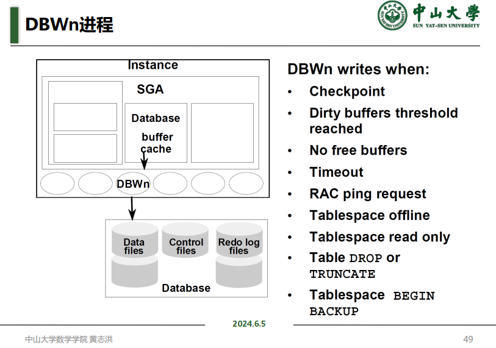

- **日志写进程（LGWR）**：将重做条目从重做日志缓冲区写入重做日志文件。

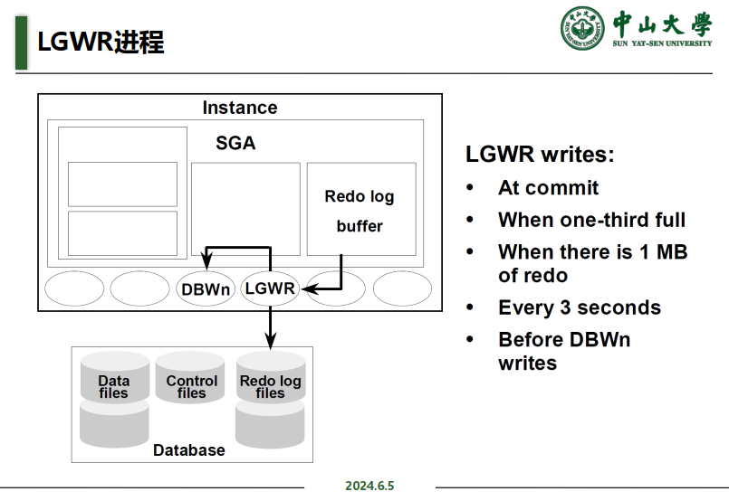

- **检查点进程（CKPT）**：负责执行检查点操作，确保数据文件和控制文件中的一致性。

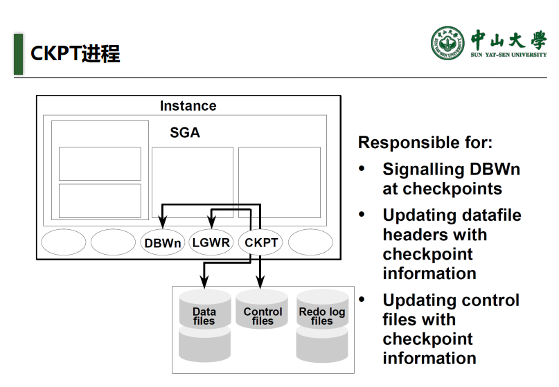

- **系统监控进程（SMON）**：执行实例恢复任务，如清理临时段和合并已提交的事务。

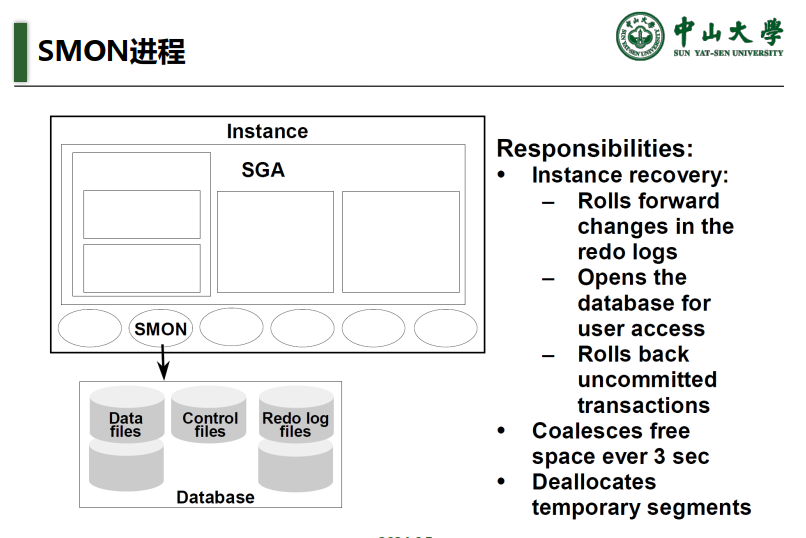

- **进程监控进程（PMON）**：清理因进程失败而中止的事务，并释放进程资源。

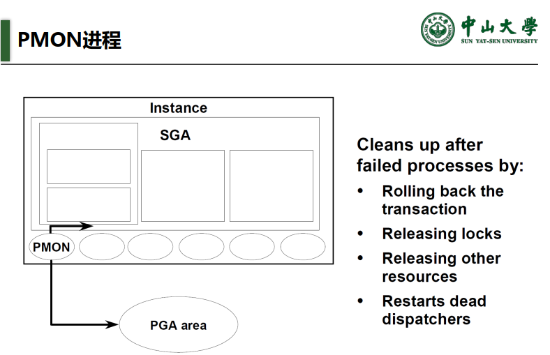

- **归档进程（ARCn）**：将在线重做日志文件复制到归档日志文件中，以备份和恢复。

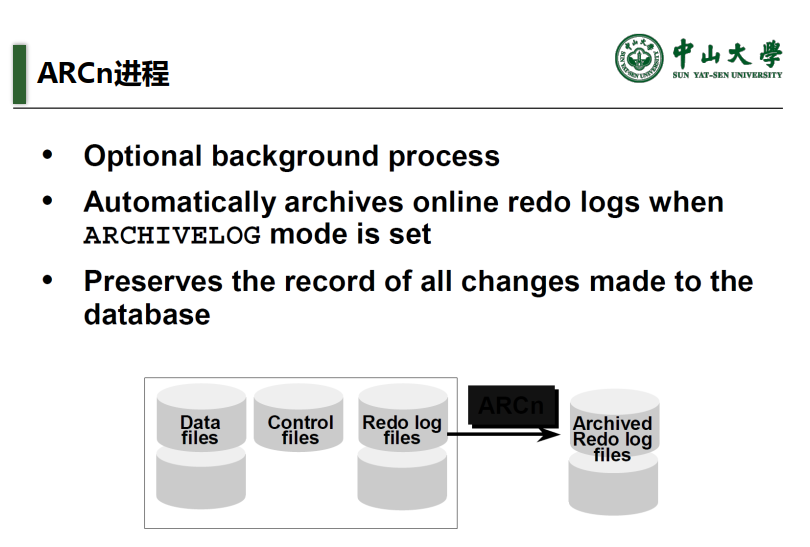

- **恢复进程（RECO）**：负责分布式数据库中的失败事务的恢复。

#### 4. 数据库文件（Database Files）

Oracle 数据库包含多个物理文件，这些文件存储实际的数据和控制信息，包括：

- **数据文件（Data Files）**：存储数据库的数据，包括表、索引等。
- **控制文件（Control Files）**：存储数据库的物理结构信息，如数据文件和重做日志文件的位置。
- **重做日志文件（Redo Log Files）**：记录对数据库的所有更改，用于数据库恢复。
- **归档日志文件（Archived Log Files）**：保存从重做日志文件归档的日志，用于数据库恢复。
- **参数文件（Parameter Files）**：存储实例启动参数。
- **密码文件（Password Files）**：存储具有 SYSDBA 权限的用户密码。

```sql
select * from v$log; -- 查看日志（组）信息
select * from v$logfile; -- 查看日志文件信息
alter system switch logfile; -- 强制切换日志
```

#### 检查点

检查点将内存中所有数据，日志写盘（CKPT引发DBWR， DBWR引发LGWR），所以当发生掉电时系统重启进行自动恢复时只需要恢复到上一次checkpoit时刻。

```sql
alter system checkpoint; -- 强制系统checkpoint
```

#### 归档模式与非归档模式 **ARCn**

- 归档模式在日志组覆盖前先保存原日志，非归档模式则不保存
- 归档模式**有完整的日志序列**，可以实现**更强大的灾难恢复**，例如可以用过时的冷备份恢复数据到当前时刻，但需要占用更多的空间资源，对于DML操作频密的系统很容易被归档日志塞满。非归档模式不对日志文件备份，不具备完整的日志系列，因此**只能恢复到备份时刻  **

```sql
select archiver from v$instance; -- 检查系统是否有归档进程
```


### 查看解析情况

在 Oracle 中，可以使用以下 SQL 语句来查看解析情况。此查询会显示当前会话中解析计数相关的统计信息，包括硬解析和软解析的次数。假设我们要查询 `emp` 表，并查看该查询的解析情况。首先，我们运行一个简单的查询来模拟解析过程：

```sql
SELECT * FROM emp WHERE deptno = 10;
```

然后，我们可以使用以下 SQL 语句来查看解析情况：

```sql
SELECT NAME, VALUE 
FROM V$MYSTAT A, V$STATNAME B 
WHERE A.STATISTIC# = B.STATISTIC# 
AND NAME LIKE 'parse count%';
```

这个查询将返回与当前会话相关的解析计数统计信息，包括硬解析（hard parse）和软解析（soft parse）的次数。

```sql
NAME                                                                  VALUE
---------------------------------------------------------------- ----------
parse count (total)                                                     894
parse count (hard)                                                      293
parse count (failures)                                                    7
parse count (describe)                                                    0
```

### 查看库缓存中的解析情况

为了更详细地查看库缓存中的解析情况，可以使用以下查询：

```sql
SELECT SQL_TEXT, VERSION_COUNT, PARSE_CALLS, EXECUTIONS 
FROM V$SQLAREA 
WHERE UPPER(SQL_TEXT) LIKE '%EMP%';
```

### 结论

- 通过应用程序（通常不是PL/SQL，是python， java， c++等等）使用循环语句向服务器发出大量“陌生”的SQL会导致出现大量hardparse，浪费很多性能
- 初级程序员（特别是不熟悉SQL的）常犯的毛病，只把Oracle作为一个存储工具，把数据全部搬回来应用端再用自己熟悉的语言进行处理，这样很容易产生大量hard parse导致性能非常低下。
- <span style="color: red;">**下策：把数据读到应用端处理（网络流量拥塞，大量硬parse），中策：在服务器端用PL/SQL写存储过程处理（PL/SQL效率不够高），上策：一条SQL语句搞定（Oracle自动优化，速度最高，但如果SQL太复杂执行计划解析错误，则需要人为调优）**</span>

### 应用程序SQL优化问题  

- 如果应用程序（R， Python等等）一定要通过循环向Oracle发出大量SQL怎样优化？
- 可以使用<span style="color: red;">**绑定变量**</span>，就是把变化的部分（例如上面insert的内容）写成PL/SQL变量，然后通过对变量赋值实现值的变化，但每次发给服务器的（带有变量的） SQL语句，服务器会认作是同一条语句，于是只需要软parse
- 网络上有大量讨论“绑定变量”的文章

### 数据库实例启动与关闭

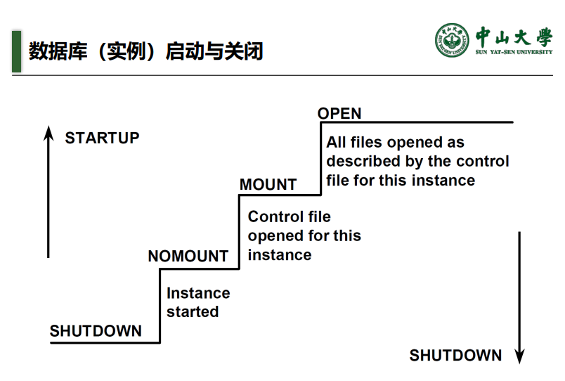

```sql
shutdown normal -- 正常关闭数据库。 发布命令后拒绝所有新的连接请求，所有连接全部退出后关闭数据库和实例
shutdown immediate -- 中断现在的连接， 未提交事务将被回滚， 然后关闭数据库和实例
shutdown abort -- 与掉电效果差不多， 直接关闭实例（重新启动后将进行修复）

startup nomount -- 启动实例
```

#### Mount 状态

- 读入控制文件，已经知道数据文件和日志文件的位置，但尚未打开，因此数据还不可以操作
- 此状态下常用于数据库修复

```sql
alter database mount;
```

### <span style="color: red;">**手工创建数据库**</span> 

*我猜大抵是不会考的*

---

## Week 16

### 一些术语

**数据库元素**: 基本操作单位，**持久保存性**

**主存缓冲区**: 临时存放数据库元素，加快操作速度，**易挥发性**

**局部变量**: 内存中保存数据库元素并进行**计算**，**易挥发性**

### 操作原语

在数据库系统中，操作原语是指执行基本数据库操作的最小单元。这些原语包括以下几种：

1. **INPUT(X)**:
   - 功能：将数据库元素X从磁盘读取到主存缓冲区。
   - 作用：加载数据以便进行后续操作。
   
2. **READ(X,t)**:
   - 功能：将数据库元素X从主存缓冲区读取到局部变量t中。
   - 作用：从缓冲区获取数据以进行计算或处理。
   
3. **WRITE(X,t)**:
   - 功能：将局部变量t的值写入到主存缓冲区中的数据库元素X。
   - 作用：更新缓冲区中的数据。
   
4. **OUTPUT(X)**:
   - 功能：将主存缓冲区中的数据库元素X写回到磁盘。
   - 作用：将数据持久保存到磁盘中，确保数据的一致性和持久性。

这些操作原语是数据库操作的基础，通过这些原语可以实现数据库的基本读写操作，确保数据在内存和磁盘之间的正确传输和存储。这些原语在具体的数据库操作过程中被频繁使用，是数据库系统实现的核心组成部分。

### 事务的一致性要求

事务的一致性是指数据库在事务执行前后都必须保持一致状态，即数据的完整性和正确性不能被破坏。事务的一致性通过以下几点来保障：

1. **事务的一致性条件**:
   - 事务开始前后，数据库必须满足一定的约束条件。
   - 例如，在银行转账操作中，从账户A转账到账户B，一致性条件是A和B的总余额不变。转账操作可以表示为事务A:=A-10000, B:=B+10000。

2. **一致性破坏的原因**:
   - 不合适的事务设计。
   - 并发执行次序设计不合理。
   - 系统故障，例如掉电。

#### 举例说明

1. **银行转账例子**:
   - 假设账户A和账户B的初始余额分别为10000和5000，总余额为15000。
   - 转账事务T1：从A转账1000到B，操作如下：
     - A:=A-1000
     - B:=B+1000
   - 事务T1执行后，A的余额为9000，B的余额为6000，总余额仍为15000，保持一致性。
   - 如果事务T1执行过程中发生错误，如仅执行了A:=A-1000，但未执行B:=B+1000，导致A余额为9000，B余额仍为5000，总余额变为14000，则一致性被破坏。

2. **库存管理例子**:
   - 假设有一个库存系统，库存量初始为100件。
   - 进货事务T2：增加50件库存，操作如下：
     - Inventory:=Inventory+50
   - 销售事务T3：减少20件库存，操作如下：
     - Inventory:=Inventory-20
   - 事务T2和T3按顺序执行后，库存量应为130件，保持一致性。
   - 若系统在执行T2后崩溃，导致T3未能执行，库存量仅为150件，则不一致。
   - 若系统在执行T3后崩溃，导致T2未能执行，库存量仅为80件，也不一致。

3. **学生成绩管理例子**:
   - 假设有一个学生成绩管理系统，记录学生的考试成绩。
   - 添加成绩事务T4：给学生A添加数学成绩90分，操作如下：
     - AddGrade(StudentA, Math, 90)
   - 修改成绩事务T5：将学生A的数学成绩从90分改为95分，操作如下：
     - UpdateGrade(StudentA, Math, 95)
   - 若事务T4和T5按顺序执行，学生A的数学成绩应为95分，保持一致性。
   - 若系统在执行T5后崩溃，导致T4未能执行，学生A的数学成绩仍为90分，则不一致。
   - 若系统在执行T4后崩溃，导致T5未能执行，学生A的数学成绩未更新，也不一致。

### 保证一致性的方法

为了确保数据库的一致性，可以采取以下措施：

- **事务设计合理**:
  - 设计事务时，确保每个事务能够从一个一致状态转到另一个一致状态。
  - 避免事务设计不合理导致的数据不一致问题。

- **并发控制**:
  - 使用锁、时间戳等机制控制并发事务的执行顺序，避免由于并发执行导致的数据不一致问题。

- **故障恢复机制**:
  - 设置日志机制，通过记录事务的操作步骤，在系统故障时进行恢复。
  - 使用Undo日志、Redo日志等恢复机制，将数据库恢复到一致状态。

### 对抗掉电的方法：日志机制及相应的修复机制

掉电故障是数据库系统中常见的问题之一，为了对抗掉电，确保数据的一致性和持久性，通常采用日志机制和相应的修复机制。以下是PPT中关于如何对抗掉电的介绍：

#### 日志机制

1. **Undo日志**:
   - **记录形式**:
     - `<START T>`：事务T开始
     - `<COMMIT T>`：事务T提交
     - `<ABORT T>`：事务T中止
     - `<T, X, v>`：事务T将数据库元素X从值v改为新值

   - **规则**:
     - 在进行数据修改前，先将旧值记录到日志中。
     - 日志记录按顺序写入磁盘，确保在发生故障时能够恢复。

2. **Redo日志**:
   - **记录形式**:
     - `<START T>`：事务T开始
     - `<COMMIT T>`：事务T提交
     - `<T, X, v>`：事务T将数据库元素X改为新值v

   - **规则**:
     - 在事务提交后，将新值记录到日志中。
     - 日志记录按顺序写入磁盘，确保在发生故障时能够重新应用已提交的修改。

3. **Undo-Redo日志**:
   - **记录形式**:
     - 结合Undo日志和Redo日志的记录形式。

   - **规则**:
     - 既记录旧值以便回滚，又记录新值以便重做。

#### 检查点（Checkpoint）

- **静态检查点**:
  - **步骤**:
    1. 停止接受新事务。
    2. 等待所有当前事务提交或终止，并在日志中写入相应的commit或abort记录。
    3. 将日志更新到磁盘。
    4. 写入日志记录`<CKPT>`并更新到磁盘。
    5. 重新开始接受新事务。

  - **优点**:
    - <span style="color: red;">**由于检查点之前的事务均已完成，所以在恢复过程中只要从尾部扫描到`<CKPT>`即可 **</span>

  - **缺点**:
    - 在操作checkpoint过程中，无法接受新事务，用户会感觉数据库系统似乎“停顿”下来。

- **非静态检查点**:
  - **设计**:
    - 允许在操作checkpoint的同时接受新事务，减少停顿时间。

#### 日志恢复机制

1. **Undo日志恢复**:
   - **思路**:
     - 从前向后扫描日志，找到已提交和未提交事务。
     - 对未提交事务，从后向前扫描日志，执行与事务相关的`<T, X, v>`，恢复数据到一致状态。
     - 恢复完毕后，在日志中记录`<ABORT T>`。

2. **Redo日志恢复**:
   - **思路**:
     - 从前向后扫描日志，找到已提交事务。
     - 对已提交事务，重新执行日志记录的修改操作。

3. **Undo-Redo日志恢复**:
   - **思路**:
     - 结合Undo和Redo日志的恢复思路，先回滚未提交事务，再重做已提交事务。

### 总结

通过巧妙地设置日志机制（如Undo日志、Redo日志和Undo-Redo日志）以及相应的恢复机制（如检查点机制和日志恢复），可以有效对抗掉电故障，确保数据库的一致性和持久性。这些机制在数据库系统中发挥着关键作用，保障了系统的可靠性和数据的完整性。

### Oracle 日志机制

在数据库系统中，Oracle的日志机制并不完全符合传统的undo、redo、undo-redo三种日志机制中的任何一种，而是采用了一种混合机制，以保证数据库的一致性和恢复能力。以下是Oracle日志机制的详细介绍：

#### 1. 日志机制概述
- **回滚段 (Rollback Segments)**:
  - 类似于undo日志，用于记录事务在修改数据前的旧值，以便在事务中止时进行回滚操作。
  
- **日志文件 (Log Files)**:
  - 类似于redo日志，用于记录事务在修改数据后的新值，以便在系统故障后进行重做操作。

#### 2. 日志切换与检查点
- **日志切换 (Log Switching)**:
  - 当一个日志组被写满时，Oracle会自动切换到下一个日志组。
  - 在日志切换时，Oracle会触发一个检查点 (Checkpoint)。

- **检查点 (Checkpoint)**:
  - 检查点是指将内存中的所有修改数据和日志记录同步到磁盘上的时刻。
  - 检查点前的日志记录在恢复时不再需要，因为所有数据修改已经持久化到磁盘上。
  - 通过检查点机制，Oracle确保了在发生故障时，只需使用当前日志组进行恢复，而不需要访问非活动状态的日志文件和归档日志文件。

#### 3. 恢复机制
- **掉电恢复 (Crash Recovery)**:
  - 当系统掉电或发生其他故障时，Oracle使用当前日志组中的日志记录进行恢复。
  - 由于检查点机制的存在，恢复过程只需处理自上次检查点以来的日志记录，从而提高了恢复效率。

- **归档模式 (Archivelog Mode)**:
  - 在归档模式下，Oracle会将日志文件复制到归档日志文件中，以便进行备份和恢复操作。
  - 使用备份数据文件和归档日志文件，可以将数据库恢复到任何崩溃时间点，确保数据的可恢复性。

#### Oracle日志机制的优势
- **混合机制的灵活性**:
  - Oracle的回滚段和日志文件相结合的机制，使得系统在处理事务时更加灵活高效。
  - 通过检查点和日志切换机制，减少了恢复过程中的工作量，提高了系统的可靠性和性能。

- **数据恢复的可靠性**:
  - 归档模式的使用确保了数据在各种故障情况下都能恢复到一致状态，极大地提高了数据的安全性。

#### 具体示例
1. **回滚操作**:
   - 用户执行一项修改操作，系统会先在回滚段中记录旧值。
   - 若用户决定取消该操作，则系统从回滚段中读取旧值并恢复原状。

2. **事务提交**:
   - 用户提交一项事务，系统会在日志文件中记录新值，并触发检查点操作，将所有修改持久化到磁盘。

3. **掉电恢复**:
   - 系统掉电后重启，Oracle会读取当前日志组中的日志记录，重新应用自上次检查点以来的所有修改，确保数据一致性。

通过以上机制，Oracle数据库系统在处理事务和恢复数据方面展现了强大的能力，确保了系统的高可用性和数据的完整性。

### 从域说起：关系代数

#### 什么是关系？
在关系数据库中，关系（relation）是指一个二维表，其中包含若干行和列。每行称为一个元组（tuple），每列称为一个属性（attribute）。

#### 域（Domain）
- **定义**: 域是属性的取值范围，即一个属性所有可能的值的集合。
- **例子**:
  - 学生表中的“年龄”属性，其域可以是所有可能的年龄值（如1到100）。
  - 课程表中的“课程编号”属性，其域可以是所有可能的课程编号（如1001到9999）。

#### 笛卡尔积（Cartesian Product）
- **定义**: 笛卡尔积是指两个集合之间的所有可能的有序对的集合。在关系数据库中，它表示两个关系之间的所有可能的元组组合。
- **例子**:
  - 假设有两个关系A和B，关系A包含两个元组{a1, a2}，关系B包含两个元组{b1, b2}。
  - A与B的笛卡尔积为$\{(a1, b1), (a1, b2), (a2, b1), (a2, b2)\}$​。

### 候选码与主码

在关系数据库中，候选码和主码是用于<span style="color: red;">**唯一标识关系**</span>中元组的重要概念。这些码在数据库设计中起着关键作用，确保数据的唯一性和完整性。

#### 候选码（Candidate Key）

- **定义**:
  - 候选码是关系中的一个或一组属性，其值能够唯一标识关系中的每一个元组。
  - 候选码具有“极小性”，即候选码的所有子集都不能是候选码。换句话说，候选码是最小的能够唯一标识元组的属性集合。

- **特点**:
  - 一个关系可以有多个候选码。
  - 候选码是场景语义决定的，而不是由当前的数据构成所决定的。这意味着候选码的选择需要理解数据的业务背景和实际应用。

- **例子**:
  - 学生表（Student）包含以下属性：学号（StudentID），姓名（Name），和身份证号（IDNumber）。
  - 可能的候选码包括：学号（StudentID）和身份证号（IDNumber）。

#### 主码（Primary Key）

- **定义**:
  - 主码是从候选码中选出的一个，用于唯一标识关系中的每一个元组。主码是候选码的一个特殊实例。

- **特点**:
  - 一个关系只能有一个主码。
  - 主码的值不能为NULL，因为它需要唯一标识每一个元组。
  - 主码在数据库中通常被用来建立索引，从而提高查询效率。

- **例子**:
  - 在学生表（Student）中，可以选择学号（StudentID）作为主码，因为它能够唯一标识每个学生，并且通常不会发生变化。

#### 主属性与非主属性（非码属性）

- **主属性（Prime Attribute）**:
  - 主属性是指候选码中的属性。主属性在关系中用于唯一标识元组。

- **非主属性（Non-Prime Attribute）**:
  - 非主属性是指不属于任何候选码的属性。在关系中，非主属性不用于唯一标识元组。

#### 关系模式（Relation Schema）

- **定义**:
  - 关系模式是关系的语义背景，包括关系的名称、属性的名称和属性的类型。
  - 在Oracle中，关系模式可以理解为表头和列的语义背景，一般不包括具体数据。

- **第一范式（1NF）**:
  - 1NF要求关系中的每个属性值都是不可再分的原子值。
  - 由全部列组成的码称为“全码”  
  - 满足1NF的关系必须有候选码，且每个元组都是唯一的。
  
- **例子**:
  - 学生表（Student）：关系模式为 Student(StudentID, Name, IDNumber)。

#### 关系代数（Relational Algebra）
关系代数是关系数据库的基础理论之一，通过一组操作定义了如何从一个或多个关系中导出新的关系。这些操作包括选择、投影、并、差、笛卡尔积和连接等。<span style="color: red;">**即世间万事万物全部都可以体现为二维表格（关系），我们可以通过这些表格中间进行预定的计算（关系代数运算）得到需要的结果。  **</span>

1. **选择（Selection）**$\sigma$:
   
   - **定义**: 从一个关系中选取满足条件的元组。
   - **语法**: σ_condition(R)
   - **例子**: 选取工资大于1500的员工
     
     ```sql
     SELECT ename, sal FROM emp WHERE sal > 1500;
     ```
   
2. **投影（Projection）**$\Pi$:
   
   - **定义**: 从一个关系中选取若干属性，形成新的关系。
   - **语法**: π_attribute_list(R)
   - **例子**: 选取员工的姓名和工资
     
     ```sql
     SELECT ename, sal FROM emp;
     ```
   
3. **笛卡尔积（Cartesian Product）**$\times$:
   
   - **定义**: 将两个关系的元组两两组合，形成新的关系。
   - **语法**: R × S
   - **例子**: 员工表和部门表的笛卡尔积
     ```sql
     SELECT ename, dname FROM emp, dept;
     ```
   
4. **连接（Join）**$\bowtie$:
   
   - **定义**: 将两个关系中满足条件的元组组合，形成新的关系。
   - **语法**: R ⨝_condition S
   - **例子**: 通过部门编号连接员工表和部门表
     
     ```sql
     SELECT ename, dname FROM emp, dept WHERE emp.deptno = dept.deptno;
     ```
   
5. **自然连接（Natural Join）**$\Join$:
   
   - **定义**: 连接两个关系中属性相同的元组，**并去除重复的属性**。
   - **语法**: R ⨝ S
   - **例子**: 自然连接员工表和部门表
     
     ```sql
     SELECT ename, dname FROM emp NATURAL JOIN dept;
     ```
   
6. **集合运算（Union, Intersection, Difference）**:
   
   - **并（Union）**: 返回两个关系中的所有元组。
     
     - **例子**:
       
       ```sql
       (SELECT ename FROM emp WHERE deptno = 10) UNION (SELECT ename FROM emp WHERE deptno = 20);
       ```
   - **交（Intersection）**: 返回两个关系中的公共元组。
   - **差（Difference）**: 返回在第一个关系中但不在第二个关系中的元组。
   
7. **除法（Division）**:
   
   - **定义**: 找出在一个关系中所有属性的组合，在另一个关系中也存在。
   - **例子**: 找出选修了全部课程的学生

#### 书写关系代数表达式的意义
- **理解SQL语句的缘起**: 理解关系代数有助于理解SQL语句的本质和优化原理。
- **简化书写**: 关系代数表达式可以比SQL语句更简洁，对于复杂查询尤为如此。
- **优化查询**: 关系代数表达式可以揭示查询的优化机会，帮助数据库系统选择最佳执行计划。

#### 关系代数恒等变换
关系代数恒等变换是指通过不同的关系代数操作组合，得到相同结果的变换规则。这些规则用于SQL查询的优化，帮助数据库系统选择更高效的执行计划。

通过关系代数的基本操作和恒等变换，可以对数据库中的数据进行各种复杂的查询和处理，从而满足各种实际应用需求。关系代数是关系数据库理论的重要组成部分，也是学习和使用关系数据库的基础。

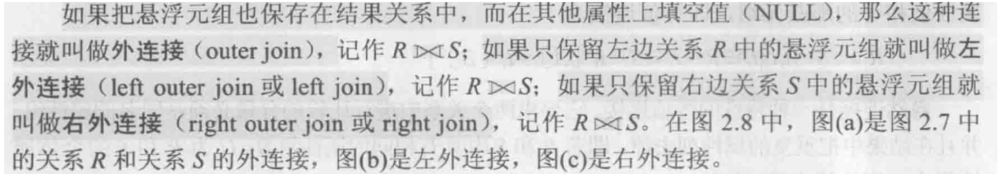

---

## Week 17

### 数据库设计

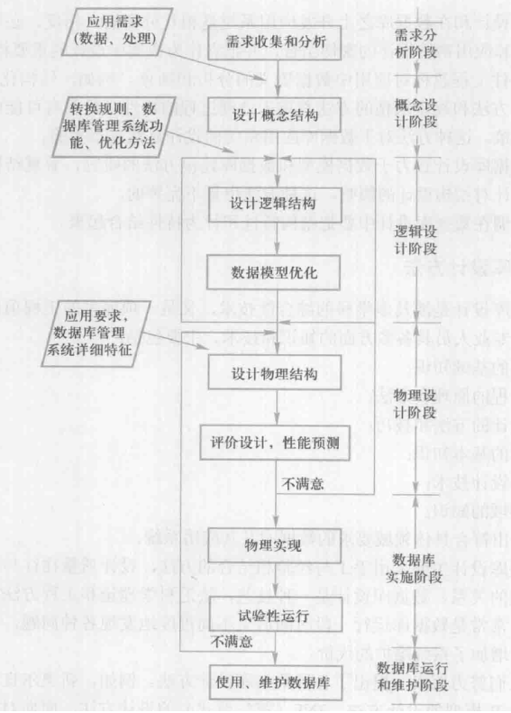 

主要讲**概念设计**和**逻辑设计**， **范式设计**和**ER图 **。

#### 函数依赖

函数依赖（Functional Dependency，简称FD）是数据库理论中的一个重要概念，用于描述属性之间的约束关系。它主要用来保证数据的完整性和一致性。在理解函数依赖时，可以从以下几个方面来把握：

假设 $ R(U) $ 是属性集 $ U $ 上的关系模式，$ X, Y $ 是 $ U $ 的子集。若对于 $ R(U) $ 的任意一个可能的关系 $ r $，其中不存在在两个元组在 $ X $ 上的属性值相等，而在 $ Y $ 上的属性值不等，则称 $ X $ 函数确定 $ Y $ 或 $ Y $ 函数依赖于 $ X $，记作 $ X \rightarrow Y $。

若 $ Y $ 不是 $ X $ 的子集，则称 $ X \rightarrow Y $ 是非平凡的函数依赖。

- **背景**：函数依赖是由语义背景（关系模式）决定的，并非由关系模式的某个实例（具体的包含数据的关系）所决定。
- **决定性**：若属性集 $ X $ 的值唯一确定了属性集 $ Y $ 的值，则称 $ Y $ 依赖于 $ X $。

1. **在学生数据库中**，假设有属性集 $ \{学号, 姓名, 班级, 年级\} $，可以说 “学号” 函数依赖 “姓名、班级、年级”，记作 $ \{学号\} \rightarrow \{姓名, 班级, 年级\} $，因为学号是唯一的，可以确定学生的其他信息。
2. **在雇员数据库中**，假设有属性集 $ \{雇员ID, 名字, 部门, 薪水\} $，可以说 “雇员ID” 函数依赖 “名字、部门、薪水”，记作 $ \{雇员ID\} \rightarrow \{名字, 部门, 薪水\} $，因为雇员ID是唯一的，可以确定雇员的其他信息。

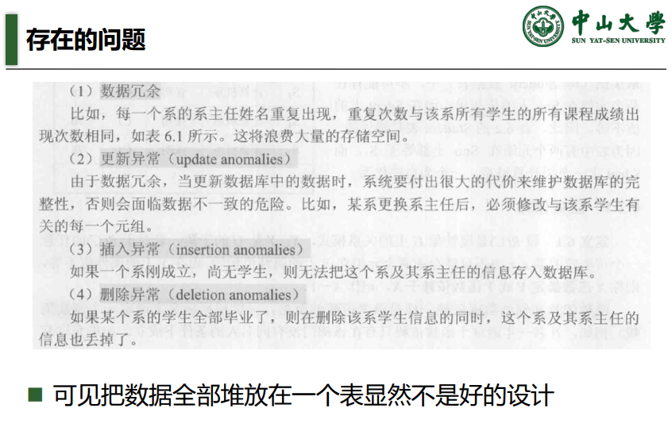

#### 规范化

在同一个关系模式内存在不良的函数依赖导致数据冗余，应解拆表消除这些不良依赖，使表的结构更加合理，这个过程我们称为“规范化”，规范化的要求是递进的。

每个范式都有不同的要求和规则：

1. **第一范式（1NF）**：数据表中的每个字段都应该是不可再分的原子值。即每列中的值都是单一的，不能是集合、列表或数组。

2. **第二范式（2NF）**：在满足第一范式的基础上，每个非主键属性都完全依赖于主键，而不是部分依赖于主键。这意味着如果存在复合主键，所有非主键属性必须依赖于整个主键而不是其中一部分。

3. **第三范式（3NF）**：在满足第二范式的基础上，表中的所有非主键属性都不依赖于其他非主键属性，即没有传递依赖。即一个非主键属性不能依赖于另一个非主键属性。

4. **BCNF（Boyce-Codd范式）**：在满足第三范式的基础上，BCNF消除了所有冗余的功能依赖。即每个非平凡的函数依赖X->Y中，X必须是超键（候选键）。

5. **第四范式（4NF）**：在满足BCNF的基础上，第四范式要求消除多值依赖。即一个表中的多值依赖应被拆分为多个表，以确保数据的一致性和完整性。

实际上存在5NF和其它更复杂的研究，<span style="color: red;">**但一般认为达到3NF已经能满足数据库设计基本要求**</span>，其它属于钻牛角尖。

#### 部分函数依赖和完全函数依赖  

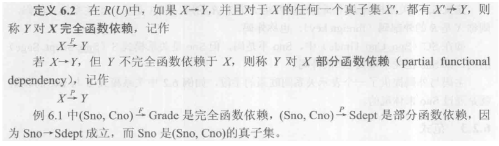

#### 完全函数依赖：

假设我们有一个学生课程成绩表 $ R(Sno, Cno, Grade) $，其中：
- $ Sno $ 是学生编号，
- $ Cno $ 是课程编号，
- $ Grade $ 是成绩。

在这个表中，如果对于每一个学生编号和课程编号的组合，都会有唯一的成绩，这意味着 $ \{Sno, Cno\} \rightarrow Grade $。并且，对于 $ \{Sno, Cno\} $ 的任何真子集（即 $ Sno $ 或 $ Cno $），都不能唯一确定 $ Grade $。因此，$ Grade $ 对 $ \{Sno, Cno\} $ 完全函数依赖。

#### 部分函数依赖：

假设我们有一个学生课程信息表 $ R(Sno, Cno, Sdept) $，其中：
- $ Sno $ 是学生编号，
- $ Cno $ 是课程编号，
- $ Sdept $ 是学生所在系。

在这个表中，如果 $ \{Sno, Cno\} \rightarrow Sdept $，但 $ Sdept $ 只依赖于学生编号 $ Sno $（即 $ Sno \rightarrow Sdept $），这意味着 $ Sdept $ 对 $ \{Sno, Cno\} $ 是部分函数依赖，因为可以通过真子集 $ Sno $ 来唯一确定 $ Sdept $。

通过这些例子可以看到，完全函数依赖是指只有整个属性集能够唯一确定另一个属性，而部分函数依赖则是指仅某些属性子集能够确定另一个属性。

#### 传递函数依赖

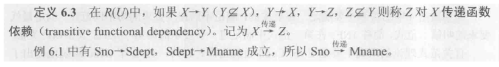

假设我们有一个包含学生信息的表 $ R(Sno, Sdept, Mname) $，其中：
- $ Sno $ 是学生编号，
- $ Sdept $ 是学生所在的系，
- $ Mname $ 是系主任的名字。

在这个表中：
1. 对于每一个学生编号 $ Sno $，都有唯一对应的系 $ Sdept $，即 $ Sno \rightarrow Sdept $。
2. 对于每一个系 $ Sdept $，都有唯一对应的系主任名字 $ Mname $，即 $ Sdept \rightarrow Mname $。

因此，根据定义 6.3，我们可以得出：
$$
Sno \overset{传递}{\Longrightarrow} Mname
$$
也就是说，通过学生编号 $ Sno $，可以唯一确定系主任的名字 $ Mname $。

这个例子清晰地展示了传递函数依赖的概念，即如果一个属性通过中间属性传递依赖于另一个属性，那么就存在传递函数依赖关系。

### 2NF

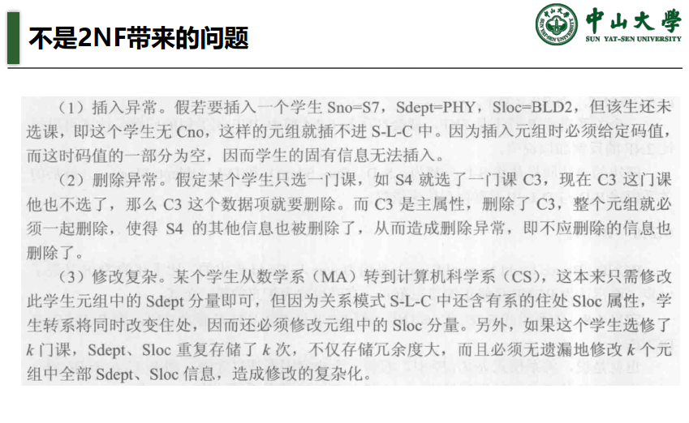

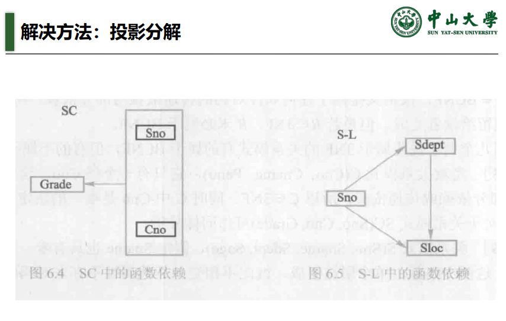

### 3NF

<span style="color: red;">**在无损连接性和保持函数依赖的前提下，任何1NF一定可以通过投影分解达到3NF**</span>。

### ER图 实体联系图

三个主要的元素类型：

1. 实体集（entity）：某种抽象对象，相似实体的集合形成的实体集。
2. 属性（attribute）：实体集中实体所具有的性质。实体集Movies可能有电影名或片长等属性。
3. 联系（relationship）：两个或多个实体集的连续。二元联系是最一般的，它联系两个实体集，E/R模型允许连接任意数目的实体集。

在实体联系图中，每种元素都用节点表示，用矩形表示实体集，用椭圆表示属性，而用菱形表示联系。

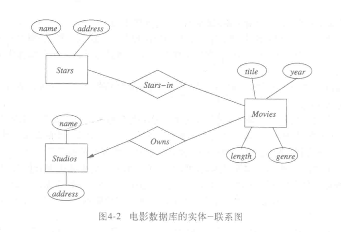

上图中有两个联系：

1. Starts-in 是电影以及影星的联系，也是影星以及其参演的电影的联系。
2. Owns是电影及其所属电影公司的联系，指向实体集studio的箭头暗示每部电影只属于唯一的电影公司。这里是唯一性约束。

E/R图是描述数据库模式的符号，而用E/R图描述的数据库包含特定的数据，称为数据库实例。对每个实体集，数据库实例有一个特定的有限实体集合，实体集中每个实体对每个属性都有特定的值，连接 $n$ 个实体集 $E_1,E_2,\cdots,E_n$ 的联系 $R$ 的一个实例由元祖的有限集构成，这样的元祖被认为是由联系 $R$ 连接起来。

#### 二元联系的多样性

- 多对一：如果 $E$ 中的任一实体可以通过 $R$ 与 $F$ 中的至多一个实体联系，那么说 $R$ 是从 $E$ 到 $F$ 的多对一 many-to-one 联系。或者说是从 $E$ 到 $F$ 的一对多联系。
- 如果 $R$ 既是从E到F的多对一又是一对多，则称为一对一联系。
- 均不是，则称多对多联系。

如果是从E到F的多对一联系，就把箭头指向F，一对一即两侧的箭头。

#### 联系的属性

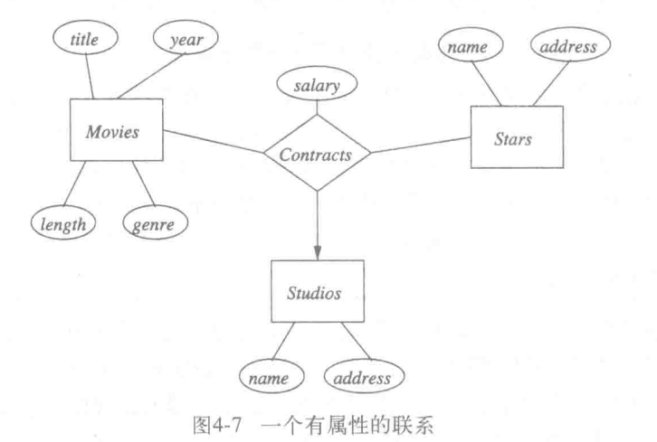

其实并没有必要为联系添加属性，人们可以创建一个新的实体集代替它，新实体集的属性就是原来属于联系的属性，如果把这个实体集包含在联系中，就可以省去联系本身的属性。

---

## Week 18

